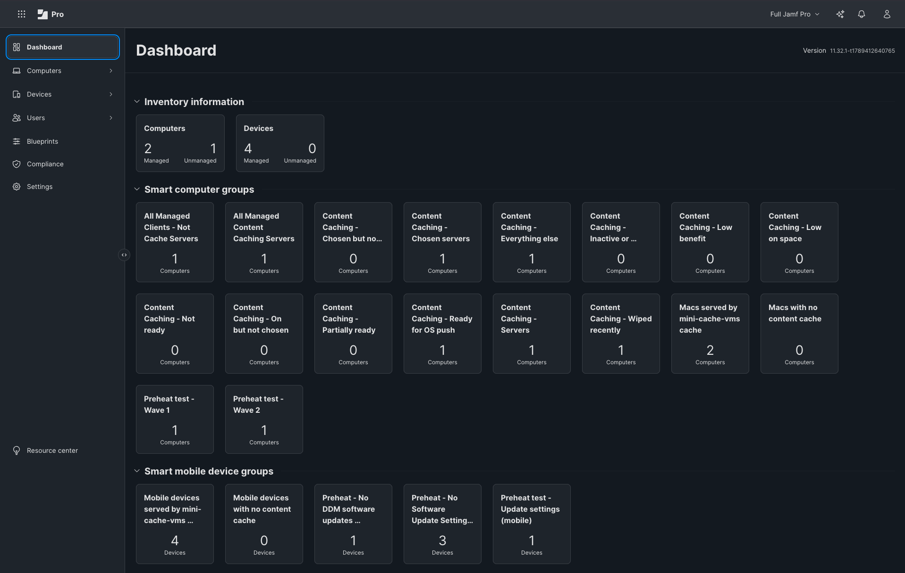
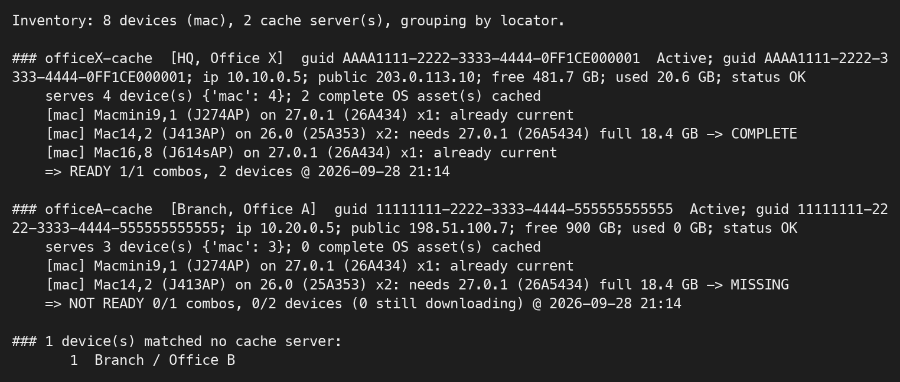

# Preheat

See from Jamf Pro whether each Apple content cache is working, which devices it serves, and whether it already holds the OS update they are about to ask for. Preheat it when it does not.

> **Status: early, working, looking for testers.** Proven end to end in one lab: one cache
> server, three Macs, three iPads and an iPhone, through three real point releases. Not yet
> done: an update enforced by a Blueprint across many devices, and a second cache server in a
> second office. The full account is in
> [What is proven, and what is not](docs/FINDINGS.md#what-is-proven-and-what-is-not).
> Issues and pull requests welcome — open one at https://github.com/masterstompie/preheat/issues.

*The day-to-day view: one cache server, ready for the next OS push, serving two Macs and four mobile devices. "Wiped recently" reads 1 because this cache's drive was erased the evening before: the tile to alert on, doing its job. "On but not chosen" and "Chosen but not caching" are the two that should always read 0. (Two captures of one page, joined. The "Preheat test" groups belong to the lab.)*

## What it tells you
Apple content caching keeps one copy of each update in the office, and saves the internet link
every time a second device asks for it. When it works it needs no help. But Apple gives an
administrator no way to see whether it is working, what it holds, or which devices can reach it.

Preheat answers one question per cache server, judged only against the devices that use that
server: does it already hold the OS update each of them is about to download?

| Verdict | Meaning |
|---|---|
| READY | every file those devices will ask for is in the cache, complete |
| PARTIAL | some of them are |
| NOT READY | none of them is; or the cache is down; or the server has gone silent |

The verdict is an extension attribute on the server's record, so Smart Groups, the dashboard and
email alerts work on it like on anything else in Jamf Pro. Beside it, Preheat shows:

- what each cache holds, by name: "iOS 27.0 (24A437) delta from 26.7 for iPhone17,3"
- which cache each Mac, iPhone, iPad and Apple TV would use
- whether the cache is earning its keep: the share of what it delivered that did not come from Apple
- whether a cache was wiped, is low on space, or is caching when nobody chose it to

When a cache is not ready, Preheat can fill it before the devices ask, with no test device at
that site: see [Preheating](docs/PREHEATING.md).

## How it works
- Jamf Pro's inventory says which hardware and which OS build every device has.
- Apple's own lookup service, the one every device asks, says which file that hardware and build
  would download next.
- An extension attribute on each cache server lists the files its cache holds.
- An extension attribute on each Mac says which cache that Mac would use, as macOS itself decides.
- `admin/readiness-check.py` puts the four together and writes the verdict.

Nothing with a password runs on a device, and nothing is installed by hand on any Mac. More in
[Reference](docs/REFERENCE.md).

## What you need
- Jamf Pro 11.31 or later, with computers enrolled and sending inventory, the cache servers
  among them. Mobile devices too, if you want iPhone, iPad, Apple TV or Vision Pro readiness.
- A Jamf Pro API role and client.
- An admin Mac, or a scheduled job, with Python 3.8 or later and no extra packages.
- One or more Macs running content caching, each with a fixed address and the Xcode Command Line
  Tools.
- macOS 27 on the cache servers, if you want their live status and to configure them by Blueprint.

The full list, with the API privileges each feature needs, is in
[Requirements](docs/SETUP.md#requirements).

## Setup, in short
| Do this | With |
|---|---|
| Create the API role and client, and store the credentials in your keychain | `python3 admin/readiness-check.py --store-credentials` |
| Create the extension attributes | `python3 admin/sync-eas.py --create`, and two text fields by hand |
| Run the check | `python3 admin/readiness-check.py`, and with `--write` to store the verdict |
| Create the Smart Groups | `python3 admin/create-smart-groups.py` |
| Have each cache server name its files | `python3 admin/create-labels-policy.py` |
| Check your work | `python3 admin/doctor.py` |
| Keep it current | run the check with `--write` on a schedule; hourly is plenty |

Each step, with its tables, is in [Jamf setup](docs/SETUP.md#jamf-setup). The same installation
as Terraform is in [`terraform/`](terraform/README.md). Every script answers `--help` and changes
nothing when asked: [docs/USAGE.md](docs/USAGE.md).

## Test without Jamf
    python3 admin/readiness-check.py --inventory-json admin/sample-inventory.json
    python3 admin/readiness-check.py --inventory-json admin/sample-inventory-large-site.json --platforms all   # two public addresses, two peer caches

Each sample carries the answers Apple gave when it was recorded (2026-09-28), so it gives the same
result whatever Apple has released since. `--record-answers` records them again.

*Report for the sample two-office fleet: Office X ready, Office A missing the Mac14,2 asset.*

## Read more
| Page | What is in it |
|---|---|
| [Setup](docs/SETUP.md) | Requirements, the extension attributes as Jamf's form asks for them, setup step by step, where things live |
| [Preheating](docs/PREHEATING.md) | Filling a cache before the devices ask: OS updates, hardware not yet enrolled, installers, Xcode, Aerials, and what cannot be preheated |
| [Blueprints](docs/BLUEPRINTS.md) | Declarative updates in two waves, a group that holds on the previous OS, update settings, and configuring the cache servers themselves |
| [Findings](docs/FINDINGS.md) | What was measured: what is proven, what one release weighs, what a full cache does, thin links and outages |
| [Caveats](docs/CAVEATS.md) | What can go wrong, each one seen in the lab; and two scripts for when clients do not see the cache |
| [Reference](docs/REFERENCE.md) | Every piece, where each fact comes from, large sites, mobile devices, live status, why a Mac downloaded at 1 pm, hardware coverage, the rest of the Jamf platform |
| [Usage](docs/USAGE.md) | Every script and every option |

## Prior art
Charles Edge's [precache](https://github.com/krypted/precache) (2016 to 2020) pre-filled the old
macOS Server Caching Service with installers, IPSWs and App Store apps, and could take its device
list from Jamf Pro. Content caching has since moved into macOS itself and updates have become
per-model deltas. Preheat starts from the same idea, that a cache can be filled before devices ask,
and adds the parts that did not exist then: knowing what a cache holds, and whether it is ready for
the devices that use it.

## Bill of Materials

| Component | Kind | Version | License |
|---|---|---|---|
| [jamf/jamfplatform](https://registry.terraform.io/providers/jamf/jamfplatform) | Terraform provider | ≥ 0.29 | Jamf — verify before redistribution |

Python dependencies: none (stdlib only). Shell dependencies: `/usr/bin/curl` (system, macOS built-in).

## Privacy

Preheat does not collect telemetry, send analytics, or phone home. It reads your Jamf Pro inventory
and queries Apple's public software update API (`gdmf.apple.com`), three other Apple catalogs for
file names (`swscan.apple.com`, `configuration.apple.com`, `devimages-cdn.apple.com`) and AppleDB
(`api.appledb.dev`). No device data leaves your network except in those outbound lookup calls, which carry no personally
identifiable information. See [Jamf's Privacy Policy](https://www.jamf.com/legal/privacy-policy/).

## License

Copyright © 2026 Jamf Software LLC. All rights reserved.

Distributed under the Jamf Concepts Use Agreement. See LICENSE for the full terms.
