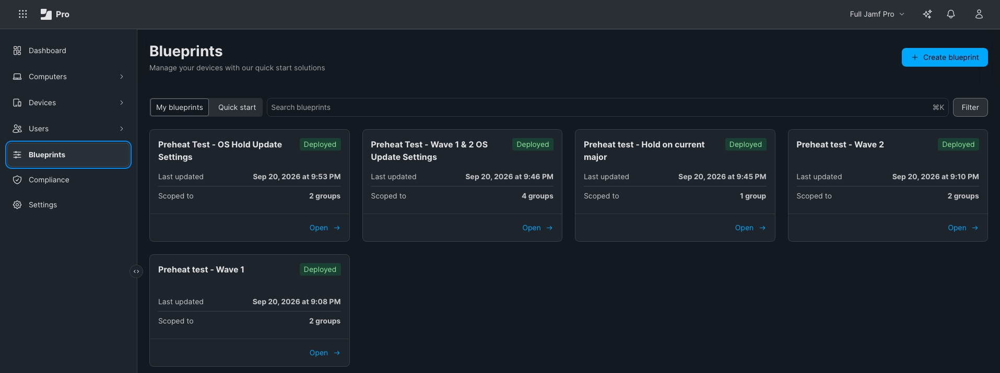
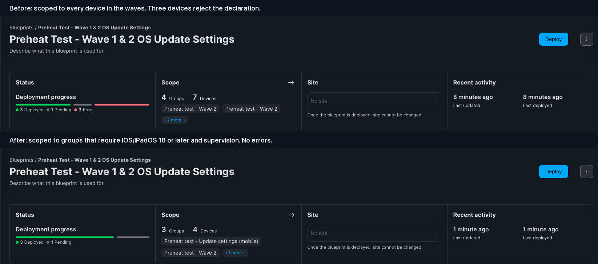
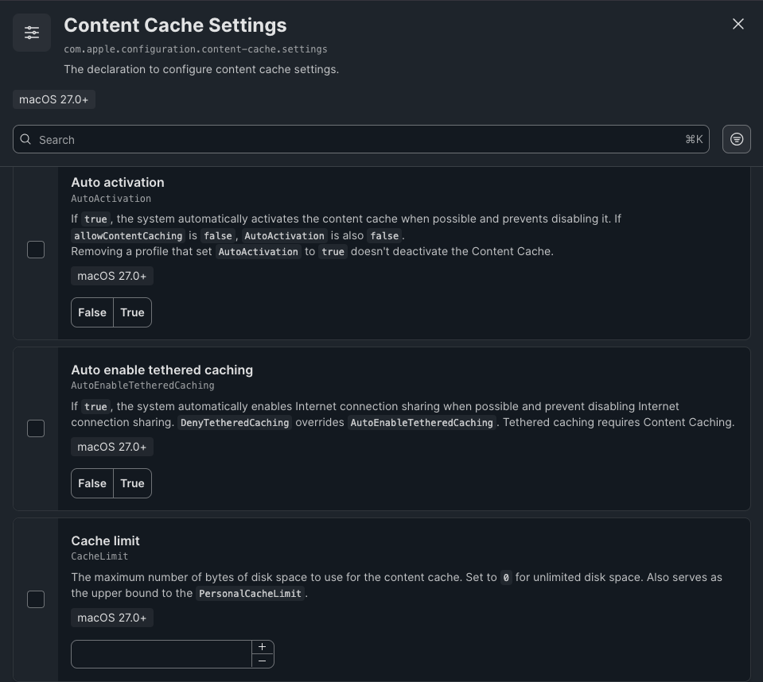

# Preheat: Blueprints

[Preheat](../README.md) > Blueprints

Declarative software updates in two waves, the update settings, and configuring the cache servers themselves.

## Using this with DDM software updates (Blueprints)
Apple's declarative update model does the "preheating" for you, if you scope it in two waves.

- When a Mac receives an enforced software update declaration it downloads and prepares the
  update in the background right away, well before the enforcement date. That download goes
  through the content cache like any other. So the FIRST Mac of each hardware family on a
  network to receive the declaration is the one that warms the cache.
- Deferrals (Software Update Settings declaration) only hide updates from users in System
  Settings for N days after release. Apple states enforced updates apply "regardless of
  configured deferrals", so a deferral does not delay the background download either.
  Deferrals stop users from pulling updates early on their own; they are not the lever for
  cache readiness.
- Recommended sequence per release:
  1. Wave 1 ("preheat"): a Blueprint with the update declaration scoped to a pilot Smart
     Group of one Mac per hardware family per cache server, enforcement date = the same date
     as everyone else or earlier. Their downloads populate each office's cache.
  2. Run `readiness-check.py --target <version>` (or `--target-build <build>` if the
     declaration pins a build). Wait for every server to show READY.
  3. Wave 2: the broad Blueprint. Every Mac's background download is then served locally.
  Content caching also coalesces simultaneous requests for the same asset, so a wave of Macs
  starting together does not each pull from Apple; the first fetch feeds the rest.
- Set the enforcement deadline further out than the deferral period, so users are not
  surprised by a forced install they never saw offered.
- A pilot group can be built per hardware family with Jamf's own criterion:
  Smart Group "one per family" = Model Identifier is <identifier>, plus a serial or name filter.

*The whole arrangement in Blueprints: an enforcement Blueprint for each wave and one for the hold group, and a settings Blueprint for the waves and one for the hold group.*

### Two cohorts: one group holds on the previous OS, the rest move on
Apple offers the last release of the previous OS alongside the new one, and most fleets use
that: a group waiting on an app vendor, a change freeze, a validated environment, hardware the
new OS dropped. In DDM terms that is two software update declarations (two Blueprints), each
scoped to its own Smart Group, one pinned to the old branch. Readiness then has to be judged
per group, because the two groups will ask the cache for different files:

    python3 admin/readiness-check.py --platforms all --cohort "Hold on 26=26" --write
    python3 admin/readiness-check.py --platforms all --cohort "Hold on 26=26.7" --cohort "Pilot ring=27.0" --preheat-plan plan.json

`GROUP=26` means the newest 26.x Apple offers each device; `GROUP=26.7` means exactly that
version; `GROUP=same` means the newest release within whatever major version each device runs
now. In Blueprints the Software Updates component's "Latest OS version" setting has an "Ignore
major versions" box: a Blueprint with it ticked is a `same` cohort, one without it follows the
default. Groups can be computer or mobile, Smart or Static; the first match wins and everyone
else follows `--target` (or the newest OS). The same Mac model in the same office then shows
as two lines, one per target, and the cache is READY only when it holds both files, so plan
the space for both. For iPhone, iPad and Vision Pro the previous branch is published on a
separate Apple channel; the scripts ask both, so a device holding on 26 is offered 26.7 even
after 27 ships. The API client needs to read the groups (Read Smart/Static Computer Groups,
Read Smart/Static Mobile Device Groups).

**Enforce the hold group too, and hide the new major from it.** Holding on a major version is
not the same as not patching: the hold group still needs 26.7.1 and its successors, so its
Blueprint keeps an enforcement deadline ("Latest OS version", "Ignore major versions" ticked,
a few days). Enforcement is also what makes the download predictable enough to check readiness
against. But an enforcement declaration only sets a floor. It does not stop a user choosing the
new major in Settings. That takes the settings declaration below: on a Mac a major deferral
(`MajorPeriodInDays`, 90 days at most, so a longer hold has to accept that the new major becomes
visible), and on iPhone and iPad, which have no separate major deferral, `RecommendedCadence`
set to `Oldest` so that only the lower-numbered update is shown when Apple offers two.

### The other half: Software Update Settings
The enforcement Blueprints say what must be installed by when. A separate Blueprint carrying
Apple's `com.apple.configuration.softwareupdate.settings` declaration says how Software Update
behaves in the meantime. Keep it separate from the enforcement Blueprints. One settings Blueprint
can serve every group that wants the same behaviour (both waves); a hold group needs its own,
because its values differ, and a device should receive only one.

| Key (Apple's name) | Everyone | Hold group | Why |
|---|---|---|---|
| `AllowStandardUserOSUpdates` (macOS) | true | true | standard users can install major and minor updates; without it only administrators can |
| `AutomaticActions` > `Download` | AlwaysOn | AlwaysOn | devices fetch in the background as soon as an update is offered, which is what sends them to the cache early and predictably |
| `AutomaticActions` > `InstallSecurityUpdate` | AlwaysOn | AlwaysOn | security responses and system files install themselves |
| `AutomaticActions` > `InstallOSUpdates` | Allowed | Allowed | the enforcement deadline does the forcing; this leaves the user free to go sooner |
| `Notifications` | true | true | users see every enforcement reminder, not only the last hour |
| `RapidSecurityResponse` > `Enable`, `EnableRollback` | true, true | true, true | Background Security Improvements stay available |
| `Beta` > `ProgramEnrollment` | AlwaysOff | AlwaysOff | no betas on managed devices (a test ring would differ) |
| `Deferrals` > `MajorPeriodInDays` (macOS) | not set | up to 90 | hides the new major from the hold group |
| `Deferrals` > `MinorPeriodInDays` (macOS), `CombinedPeriodInDays` (iPhone, iPad, Apple TV, Vision Pro) | not set, or 1 to 3 days | same | optional: a short delay before users are offered a release is a window in which to preheat; enforced updates apply regardless of deferrals |
| `RecommendedCadence` (iPhone, iPad, Vision Pro) | All | Oldest | when Apple offers two versions, the hold group sees only the lower one |

Key names and allowed values are from Apple's device management documentation (checked
2026-09-20). Deferrals, automatic actions and security-response settings need supervised devices.
In Jamf Pro 11.32 the Blueprints "Software Update Settings" component exposes every key above, each
shown with Apple's key name under its title, so no configuration profile is needed. Three things
to know in that screen: only the settings whose box you tick are sent; AlwaysOn and AlwaysOff
appear as "Always" and "Never"; and the two Background Security Improvements settings come
preselected on "Restrict", so after ticking them switch both to "Allow" unless you mean to block
them. Automatic downloads and automatic security installs are not offered for Apple TV.

**Scope the Blueprints to devices that can take them.** Found by scoping them to everything in a
lab: the enforcement declaration needs iOS/iPadOS 17 or macOS 14 (an iPad on 16 reports every one
as "InvalidPayload"); the settings declaration needs iOS/iPadOS 18 or macOS 15 (an iPad on 17
reports "Unknown Declaration Type"); and a settings declaration that contains deferrals, automatic
actions or security-response keys is rejected whole by an unsupervised device ("cannot be enforced
on unsupervised devices"), which in practice means user-enrolled and personal devices. A Blueprint's
scope is a list of groups with no exclusions, so build the rule into the groups it is scoped to:
OS Version greater than or equal to 17 in the groups for the enforcement Blueprints, and a separate
group with OS Version greater than or equal to 18 and Supervised is Yes for the settings Blueprint.
Devices left out are still counted by the readiness check and still preheated for, because that
works from inventory, not from Blueprint scope; they simply update on their own schedule. The rest of what a "Latest OS
version" Blueprint shows as failures is expected: it sends one activation per OS version Apple
offers, each with a predicate, and a device reports every one that does not apply to it as
inactive, with its configuration "ActivationFailed". A healthy Mac shows about forty of those.

*The same settings Blueprint, scoped first to every device and then to groups that carry the requirement: three errors, then none.*

### Configuring the cache servers themselves with a Blueprint (macOS 27)
From macOS 27 a cache server can be configured by declaration, and Jamf's Blueprints have a
component for it: **Content Cache Settings** (`com.apple.configuration.content-cache.settings`).
It exposes every setting, each with Apple's key name under its title. Two Blueprints cover most
organisations.

**A declaration replaces the cache's whole configuration.** Only the settings you tick are sent,
but every setting you leave out goes back to Apple's default on the Mac, whatever had been set by
hand. Seen on the lab cache when a Blueprint with three settings arrived: its limit went from
4 TB to unlimited and iCloud caching, which had been switched off, came back on. So tick every
setting whose value matters to you, not only the ones you want to change. (The storage path was
the one hand-set value that stayed; declare it anyway.) When the first declaration arrived, and
when the limit and the storage path were added, the cache switched off, told Apple it had gone,
switched on and registered again, within ten seconds; its content was kept and its counters
started again from zero. A later change of one setting (Log client identity) was applied in
place: no restart, counters untouched.

**1. The cache servers.** Scope it to a group of the Macs you have chosen as cache servers (a
Static group, or a Smart Group by name or serial number). Do not scope it to "Content
Caching - Servers": that group means "caching is on", so a cache that goes off would fall out of
the very Blueprint that turns it on.

| Setting | Value | Why |
|---|---|---|
| Auto activation | True | Turns caching on and stops anyone switching it off |
| Allow shared caching | True | OS updates, apps, everything Preheat deals with |
| Allow personal caching | True or False, but tick it | iCloud data. Left out, it is True. One of the two "Allow" settings must be True |
| Keep awake | True | A sleeping Mac serves nothing |
| Allow cache delete | False | Otherwise macOS empties the cache when other software wants the space |
| Cache limit | bytes | Left out, or 0, it is unlimited, which fills the volume to its last 2 GB. Leave about a tenth of the volume free |
| Declarative status interval | 300 | Without it the size figures in DDM status are not refreshed |
| Data path | the path in use, if not the startup volume | Must end with `/Library/Application Support/Apple/AssetCache/Data`. A cache given a new path tries to move its content there |
| Port | a fixed number, if firewalls sit between devices and cache | 0 picks a port at random |
| Log client identity | True, if the cache's log should say which device asked | Off by default: the log names the file, not the device. On, each request is logged with the address it came from |

**2. Every other Mac.** One setting, **Deny activation: True**, so that no one's laptop becomes a
cache by accident and starts being offered to the devices around it. A Blueprint's scope has no
exclusions, so the group has to carry the rule: a Smart Group with the criterion Computer Group,
"not member of", your cache servers group.

**Scope both by your choice of servers, not by what is running.** It is tempting to scope the
deny Blueprint to "Macs that are not caching" and the settings to "Macs that are". Both go wrong,
because the Blueprint changes the thing the group measures:

| Scope by state | What goes wrong |
|---|---|
| Deny to "not caching" | A laptop that already has caching on is not in the group and is never denied |
| Deny to "not caching" | A new server cannot be switched on: it is denied until it caches |
| Settings to "caching" | A server that goes off leaves the group, and with it the Blueprint that keeps it on |

Keep the state groups for what they are good at, reporting and alerts, and compare the two:

| Group | Rule | Use |
|---|---|---|
| Content Caching - Chosen servers | Serial Number is ..., one line per server (or a Static group) | scope of the settings Blueprint |
| Content Caching - Everything else | Computer Group, not member of, Chosen servers | scope of the deny Blueprint |
| Content Caching - On but not chosen | status EA like Active or Inactive, and not member of Chosen servers | a cache nobody planned: alert |
| Content Caching - Chosen but not caching | member of Chosen servers, and status EA is "Not a content cache" | a server that is off: alert |

These four are made by hand, because only you know which Macs you chose; the rules are the whole
recipe. `create-smart-groups.py` and the Terraform module make the groups that are the same for
everyone.

(Jamf Pro has built-in groups "All Managed Clients" and "All Managed Servers"; state groups
named "All Managed Content Caching Servers" and "All Managed Clients - Not Cache Servers" sit
beside them in every list.)

**For larger networks**, the same component holds the settings that go with [Large sites](REFERENCE.md#large-sites-several-public-addresses-favored-caches-peers):

| Setting | Use |
|---|---|
| Public ranges | Every public address the site uses. Goes with the DNS TXT record: the record tells devices, this tells Apple |
| Local subnets only | True (the default) serves the cache's own subnet. For more subnets set it False and give Listen ranges |
| Listen ranges, Listen ranges only | Which client addresses the cache serves |
| Peer local subnets only, Peer filter ranges, Peer listen ranges | Which other caches it shares with. By default, those on its own subnet |
| Parents, Parent selection policy | Caches this one fetches from before Apple: a branch cache behind a head-office cache |
| Management status target, reporting interval, security | A URL the cache sends its own statistics to, as often as once a minute. Preheat does not use it yet |

Three traps in that component. **Data path is filled in for you with Apple's default**,
`/Library/Application Support/Apple/AssetCache/Data`, which is on the startup disk. For a cache
on an external volume, replace it before you deploy with the full path,
`/Volumes/<volume name>/Library/Application Support/Apple/AssetCache/Data`. Left as it is, it
tells the cache to move its content to the startup disk.
Ticking **Peer listen ranges** or **Peer filter ranges** and adding no item sends an empty list,
which means "answer no peer" and "ask no peer": peering is off. And **Local subnets only: True**
makes the cache ignore Listen ranges altogether.

What Preheat reads back is unchanged by how a cache was configured: its state, peers and parents
through DDM, its content through the EAs.

*Status, 2026-09-27: both Blueprints are deployed in the lab. The deny Blueprint took about ten
minutes to arrive, after which macOS reported "Content caching can not be activated". The
settings Blueprint was delivered with three settings (allow cache delete off, keep awake, status
interval 300): all three took effect, the cache kept its 1,889 GB, and the size figures in DDM
status, frozen until then, were refreshed. A second delivery added the two "Allow" settings, the
limit and auto activation, which all took effect, and the storage path. The settings for larger
networks have not been tried.*

*Jamf's Blueprint component for a cache server: each setting carries Apple's key name, and only the ones ticked are sent.*
