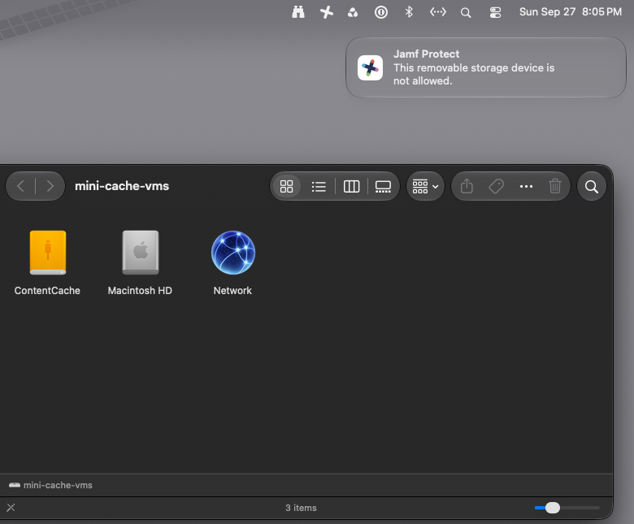

# Preheat: Caveats

[Preheat](../README.md) > Caveats

What can go wrong, each one seen in the lab.

## Caveats
- **Two outside services.** Answers come from Apple's software lookup service (gdmf.apple.com),
  which is public but undocumented, and the model list, board IDs and build numbers come from
  [AppleDB](https://appledb.dev), a community project. If either changes shape the lookups stop
  until the scripts are updated; nothing on the devices or in the cache is affected.
- **A refused registration wipes the cache.** (An unreachable Apple only suspends it; see
  [Thin links and outages](FINDINGS.md#thin-links-and-outages).) If the server cannot register
  with Apple (a VPN changes its public IP, egress is blocked, Apple returns 403) it deletes
  everything about two minutes later. Ten minutes after that it is Active, registered and
  reporting "status OK", with nothing in it. So the "Inactive or broken" group is not enough of
  an alarm: the effectiveness EA's WIPED flag and the "Content Caching - Wiped recently" Smart
  Group exist for exactly this. Keep the server's public IP and egress stable, and keep any VPN
  client that connects at startup off it.
- **A cache server needs a cable, a fixed address and an unattended restart.** Use Ethernet:
  the same 237 MB file took 8 to 12 s from the lab cache on Wi-Fi and 4 s wired, and on Wi-Fi the
  cache registers with Apple again every time its link speed changes. Give it a DHCP
  reservation (if it must use Wi-Fi, set the network's private Wi-Fi address to Fixed or Off, or
  the reservation will not hold). Devices keep a cache's address for an hour, so after an address
  change they try the old one until their next lookup. A Mac with FileVault on waits at the
  unlock screen after a restart and serves nothing until someone logs in. With FileVault off it
  serves from the login window: on the lab cache (macOS 27, content on an external USB drive)
  the drive was mounted, the cache registered and a 1.9 GB file served from cache one minute
  after a restart, with nobody logged in and no automatic login. A restart also sets the cache's
  counters back to zero, so the effectiveness EA reads NEW for a while afterwards.
- **A cache server updates itself too, and serves nothing while it does.** In the same
  enforcement Blueprint as the other Macs it restarts at their deadline, in working hours, and
  the cache is out of service for some minutes. It comes back by itself with its content. Give
  cache servers their own Blueprint, with a deadline outside working hours.
- **The cache's storage is a path, not a drive.** Rename or erase the volume and content caching
  switches itself off ("Timed out waiting for /Volumes/... to appear" in its log) and the EAs read
  "Not a content cache", the same as a Mac that never was one. Choose the volume again under
  Sharing > Content Caching > Options. `doctor.py` names a Mac that was a cache and no longer is.
  In the Options slider the far right is "Unlimited", which fills the volume to its last 2 GB;
  for a smaller limit use `defaults write /Library/Preferences/com.apple.AssetCache.plist
  CacheLimit -int <bytes>` and `AssetCacheManagerUtil reloadSettings`.
- **An external cache drive can be the only storage the server accepts.** A cache server with
  FileVault off and its content on an external drive is a Mac anyone nearby can plug a drive
  into. Jamf Protect's removable storage controls close that: a control set whose default
  permission is Prevent, with one override for the cache drive, in a plan scoped to the cache
  servers and nothing else. Tested 2026-09-27 on the lab cache (Jamf Protect 8.20, macOS 27):

  | Test | Result |
  |---|---|
  | The plan arrives while the cache drive is mounted | the drive stays mounted; the cache reads from it and writes to it as before |
  | A second drive, of another make, is plugged in | refused, with Protect's notice on screen; refused again when macOS was asked to mount it; the cache was not disturbed |
  | The server restarts | the cache drive mounted at the login window, three seconds after Protect had started; the cache was Active and serving within a minute |

  Two limits. An override names a vendor ID, a product ID or a serial number, and many drive
  enclosures report their bridge chip's identifiers and a default serial number (the lab's:
  ASMedia, 0x174c / 0x55aa, serial 000000000001). A rule on those allows every enclosure built
  on that chip, not one drive. A ready-made external SSD is the better choice where this matters:
  it reports its maker's own identifiers and a serial number of its own (the second drive in the
  test, a SanDisk portable SSD, did), so an override by serial number allows that one drive and
  no other. And an override that applies to unencrypted drives stops matching if the drive is
  encrypted later, which would block the cache's own storage. A cache whose drive is blocked
  switches itself off, so deliver the plan to one server and check it before the rest.

*A second drive plugged into the cache server: Protect's notice, and only the cache drive in the Finder.*
- **Jamf "Calculate sizes" (home folder sizes) can hang inventory** on any Mac with a
  streaming cloud drive (Google Drive, OneDrive, iCloud) in the home folder: recon walks the
  cloud folder and waits on metadata fetches. Turn it off under Settings > Computer
  Management > Inventory Collection. It has nothing to do with these EAs but blocks them.
- **VPN, ZTNA and SASE clients: it is the tunnelling model that matters, not the vendor.**
  A client uses a cache only when two things hold: Apple's locator sees the client's query
  from the same public IP the cache registered with, and the client can reach the cache's LAN
  address directly. Per-app ZTNA satisfies both by default, because traffic that matches no
  access policy is handled as if the client were off: Jamf Connect's ZTNA works this way, and
  so do the app-based modes of other vendors. Full-tunnel or "secure internet"
  modes (tunnel-all VPN profiles, cloud web gateways that carry all traffic) break the first
  condition, since Apple then sees the tunnel's egress address; the standard fix is the
  client's exclusion or bypass list: Apple's locator, registration and update hosts (the list
  is in Apple's "Use Apple products on enterprise networks") plus the office subnets.
  On-device filters that do not tunnel (DNS filtering, endpoint protection) change nothing.
  The "Macs with no content cache" Smart Group is the detector: office Macs landing there means
  something is in the way. (The ZTNA part follows Jamf's published
  [network engineer's guide](https://concepts.jamf.com/en/guides/resource-access-control/network-engineers-guide-to-private-access/);
  it has not been tested on hardware.) Two admin choices to avoid in any ZTNA product: a Direct IP policy overlapping
  an office subnet, and a policy covering Apple's hosts.
- **The cache server itself must not be behind a tunnel.** Registration must reach Apple
  from the server's real public IP, and a change of that address costs the whole cache (see
  "A refused registration wipes the cache" above). Exempt at least lcdn-registration.apple.com, suconfig.apple.com and
  Apple's update CDNs, or keep the server off the client entirely.
- **Remote Macs should not be routed through an office cache.** It is constructible (a Direct
  IP policy for the server, its public-ranges setting widened to the ZTNA egress ranges, its
  listen ranges widened to the gateway subnet) but the bytes then travel Apple to office to
  cloud to Mac: the office uplink pays for every update and the remote Mac gains nothing.
  Content caching only ever saves the last local hop.

## Clients do not see the cache

A client finds a cache by asking Apple for the servers registered under the client's public address, then connecting to the server directly on its port. Four things must hold: the client and the server leave for the internet from the same public address; the server is registered; the server is set to serve the client's subnet; the server's port is reachable. Two read-only scripts check all four:

- On the caching Mac: `sudo bash admin/troubleshoot-server.sh`
- On a Mac that does not see it: `bash admin/troubleshoot-client.sh <server address> <port>` (address and port from the server's output)

Read the server's output first.

| Line | Problem value | What to do |
|---|---|---|
| `Activated` / `Active` | `false` | Turn the service on: System Settings, General, Sharing, Content Caching. |
| `RegistrationStatus` | `0`, or a `RegistrationError` line | The server cannot reach Apple's registration service. It needs outbound HTTPS to Apple (17.0.0.0/8) with no proxy or TLS inspection in the path. |
| `LocalSubnetsOnly` | `true` with clients on other VLANs or on Wi-Fi | The default serves only the server's own subnet. Set Clients to "all networks", or add ranges. |
| `Port` | random | Set a fixed port if a firewall or an ACL sits between clients and the server. |
| `PublicAddress` | differs from the client's | Different internet exits: dual WAN, SD-WAN, a guest VLAN with its own NAT, or a security agent on the client (ZTNA, always-on VPN, a cloud web filter). Either put both on the same exit or declare the ranges to the server (Advanced, Clients, public IP ranges) or in a `_aaplcache._tcp` DNS TXT record. |
| no `Received GET` lines | | No client has asked. They never found the server, or the port is blocked. |

Then the client's.

| Line | Value | Meaning |
|---|---|---|
| public address | differs from the server's | Stop here; fix the exit first. |
| `Found 0 content caches` with matching address | | Apple has no registration for that address: back to `RegistrationStatus` and `LocalSubnetsOnly`. |
| `Found 1`, port `BLOCKED` | | Firewall on the server, an ACL between VLANs, or client isolation on the Wi-Fi network. |
| `Found 1`, port `open` | | The client is fine. It remembers a located result for about an hour; after a server-side fix, run `AssetCacheLocatorUtil` on the client to refresh. |

Also: a caching server on Wi-Fi or allowed to sleep unregisters; use Ethernet and prevent sleep. The cache does not use Bonjour, so multicast settings do not matter. The "Macs with no content cache" Smart Group (docs/SETUP.md) lists which clients do not see a server; the list usually maps onto one VLAN, site or SSID.
