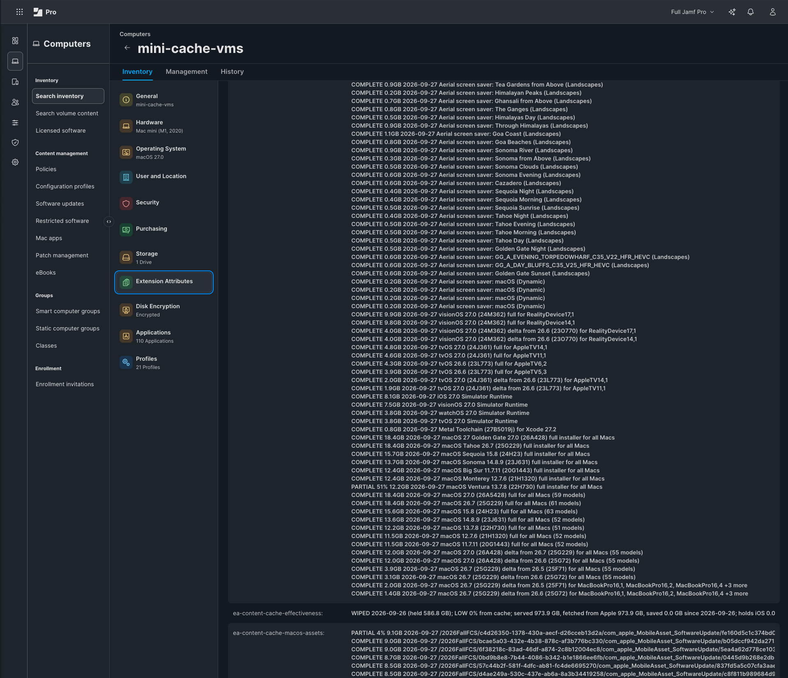
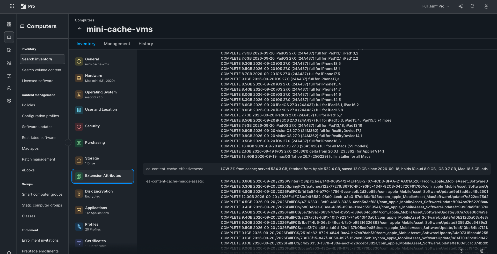

# Preheat: Findings

[Preheat](../README.md) > Findings

What was measured in the lab: what is proven, what one release weighs, what a full cache does, thin links and outages.

## What is proven, and what is not
Proven end to end on one lab: an M1 Mac mini
cache server, two Apple silicon Macs, three iPads (2016 to 2021) and an iPhone XR, Jamf Pro
11.32. Two real point releases have gone through it: an iPad Pro from 2017 (iPadOS 17.7.10 to
17.7.11) and the iPhone (iOS 18.7.9 to 18.7.10) were each planned, preheated, and updated
from the cache with nothing fetched from Apple. Lookups are checked against every model
Apple has shipped since 2013, not only this hardware, and 187 update files covering every
current model (from 26.7 to 27.0, and from 26.6 to 26.7) were planned, pulled through the
cache and named by it without a failure. Beyond OS updates, full macOS installers, Xcode
components and Aerial screen savers have been preheated the same way, and the cache's
behaviour on a thin link and through an outage has been measured. The first Mac point release (27.0 to 27.0.1,
2026-09-28) arrived by an enforced Blueprint: the file the check had predicted for both lab Macs
is the file that reached the cache, and a third Mac then took all 3.3 GB of it from the cache with
nothing fetched from Apple. Not yet done: an update enforced by a Blueprint across many
devices, and a second cache server in a second office. Peer caches are proven on two real caches. Configuring cache servers and
denying caching on every other Mac by Blueprint (macOS 27) is proven on the same lab. Sites with more than one public
address and favored caches are handled but have only been run against sample data: testers
with such a network are the most useful of all. Hardware where a tester would help most: an Intel Mac with a T2 chip (its lookup is
inferred, not confirmed), any Intel Mac, a current iPhone, Apple TV and Apple Vision Pro.
Issues and pull requests welcome.

## What the caveats rest on
Each was seen in the lab. The advice is in [Caveats](CAVEATS.md); this is the evidence.

| Seen | Date |
|---|---|
| A cache that could not register deleted 19.71 GB two minutes later ("Still not registered, flushing the cache") | 2026-09-19 |
| A consumer VPN connecting at startup cost a 500 GB cache within two minutes of a restart; ten minutes later the server reported "status OK" with nothing in it | 2026-09-20 |
| Two iPads behind a consumer VPN matched no cache server, and found the cache when the VPN was turned off | 2026-09-20 |
| The size figures in DDM status stood still for 45 minutes while the cache grew by 99 GB; they moved once the declaration set a status interval | 2026-09-26 |
| A Mac with caching just switched on joined a group built on Jamf's own criteria one inventory late | 2026-09-27 |
| A Blueprint delivered with the pre-filled data path made the cache try to move 1.9 TB to the startup disk; only the lack of space stopped it | 2026-09-27 |
| The cache server restarted for its own update at 14:00 on a working day; the cache was out of service for about six minutes | 2026-09-28 |
| The cache server lost its network address; for an hour and a half Jamf showed an Active, READY cache that no device could reach | 2026-09-28 |

## What one OS release looks like in a cache
Measured on 2026-09-20 by asking Apple's lookup service on behalf of 212 models and pulling
every OS 27 full image through one Mac mini cache (56 files, 491 GB, all named by the decoded EA):

- **macOS is one universal file.** The 18.4 GB macOS 27.0 full image and the 12.0 GB delta from
  26.7 each serve every supported Mac. (Where Intel Macs are still supported, as on 26.x, they get
  their own smaller delta: 1.4 GB from 26.6 to 26.7 against 3.1 GB for Apple silicon.) A Mac-only
  site needs very little cache per release.
- **iPhone and iPad are per model.** Recent iPhones each have their own 8 to 9.5 GB file (older
  pairs such as iPhone 12 and 12 Pro share one); iPads share within a generation. 53 full images
  in all, about 454 GB. A mixed mobile fleet, not the Macs, decides how big a cache must be.
- **Wi-Fi and cellular usually share a file, but not always.** iPad (A16) has separate Wi-Fi and
  cellular files, and iPhone 18 Pro Max has separate US and Global files. Always match on the
  exact model identifier.
- **Devices take deltas, not full images.** Asked with a device's real version and build, Apple
  also offers a delta (iPhone 16: 9.1 GB full, 4.5 GB from 26.7, 6.1 GB from 26.0), and that is
  what the device downloads. A cache warmed with full images only will miss. The readiness check
  asks with each device's real build, so its plans contain the right file. iOS offers a delta
  only when version and build both match a real release; macOS matches on build alone.
- **tvOS ignores the source build** and returns every delta back to tvOS 16 plus the full image.
- **One release does not fit in 511 GB.** Full images (454 GB) plus iPhone and iPad deltas from
  the previous release (81 files, 327 GB) come to about 780 GB before any app or iCloud content.
- **New hardware appears in the lookup service before it ships**, so a cache can be warm for a
  model on the day it arrives.

*Six kinds of content on one cache server's record, each named by the server itself at check-in: Aerial screen savers, visionOS and tvOS updates, Xcode components, full macOS installers, macOS updates and deltas. Names above, Apple's opaque paths below. Taken on 2026-09-27 while the whole cache was being refilled, so two lines are PARTIAL: the file downloading at that moment, and an installer whose download had stopped halfway (what led to `preheat.sh` checking that every byte arrives). The whole list at that moment, 361 lines: [decoded-ea-whole-list.png](images/decoded-ea-whole-list.png).*

## Is the cache earning its keep?
A content cache that works needs no help; one that has quietly stopped working looks exactly the
same from Jamf. The effectiveness EA reads the cache's own counters: of everything it delivered
to devices, how much did not have to come from Apple, since when, what it holds by type, and
whether it is under pressure to evict. The first word (GOOD, FAIR, LOW, NEW) feeds the Smart
Group "Content Caching - Low benefit", which finds caches few devices use or can reach.

**A whole catalogue, measured (2026-09-27).** Everything Preheat can plan, pulled into an empty
cache on a 4 TB drive in one run: every supported model's full image, the deltas from two
starting versions to 27.0 and to 26.7, the newest full installer of each macOS, Xcode's
components and every Aerial.

| Content | Files | GB |
|---|---|---|
| iPad updates | 263 | 799 |
| iPhone updates | 172 | 700 |
| Mac updates | 13 | 136 |
| Full macOS installers | 7 | 103 |
| Aerial screen savers | 164 | 80 |
| Vision Pro updates | 4 | 28 |
| Xcode components | 5 | 24 |
| Apple TV updates | 6 | 22 |
| **All** | **634** | **1,890** |

It took 14 hours 8 minutes, 37 MB/s on average, on a gigabit line behind a home router that
forwarded about 300 Mbit/s. The cause was found afterwards: a bandwidth limiter on a guest
network had switched off the router's hardware acceleration for every device. With the limiter
off and the router restarted, the same cache server downloaded from Apple at 860 to 890 Mbit/s,
which would have made this a five-hour job. A preheat is as fast as the slowest of the line,
the router and the cache's disk, so measure from the cache server before a large one. Afterwards
every one of the 634 files was complete, the same size as planned to within 0.05 GB, and named;
the labels refresh took 3 seconds at a check-in and the inventory update 28. Three downloads had
stopped partway during the run and were pulled again, which is why `preheat.sh` now checks that
each file arrives whole. No organisation needs all of this; it is the upper bound.

**What a full cache does (tested 2026-09-20).** A 511 GB cache holding 502 GB was sent another
44.8 GB. Every download succeeded. The cache let free space run down to almost nothing, then
removed about 18 GB in one go, and repeated: a sawtooth, with its pressure figure climbing from
0.2 to 0.8. It removed the oldest files nobody had asked for since they arrived: first a full
installer from two days earlier, then a tvOS delta, then the macOS 27 full image that serves
every Mac. It has no idea what a file is worth. The two files real devices had used that morning
survived. The lesson for preheating: a preheated file that no device has touched yet looks like
the least valuable thing in the cache, so on a small, busy cache it can be the first to go.
Preheat after Apple publishes but not days ahead of need, size the cache for what it must hold,
and let the readiness EA tell you when READY has quietly become NOT READY.

*A lab cache filled by hand and used by two devices reads LOW 2%: honest. A busy office cache should read GOOD.*

## Thin links and outages
Measured on the lab cache, 2026-09-26, by cutting and then limiting its internet at the router
and reading the cache's own log.

**The cache asks Apple about every file before it serves it.** Each request from a device makes
the cache send one small question to the file's origin ("changed since I stored it?"). Apple
answers "no" (HTTP 304) in about a tenth of a second and the file is served from disk.

| The cache's internet | What devices get |
|---|---|
| Normal | cached files at LAN speed |
| Limited to 0.125 Mbit/s | cached files at LAN speed: 738 MB in 12 s, first byte after 0.7 s. A file the cache does not hold arrives at the link's speed (11 KB/s) |
| None | nothing. The question to Apple times out and the file is not served, from the first request. Content on disk is not enough |

**What an outage does to the cache itself**

| After the link is lost | |
|---|---|
| at once | requests fail (the device waits about two minutes for an error) |
| 3 failed registrations, about 20 to 35 minutes | the cache suspends itself: not Active, answers HTTP 503 immediately |
| while suspended | the content stays. 674 GB was intact after 33 minutes suspended |
| link returns | the cache does not notice. It resumes at its next registration attempt, and the wait between attempts grows (1, 1, 9, 17 minutes). A 55-minute outage cost 66 minutes of service and no content |

This is different from the wipe under Caveats: there Apple answered and refused the registration.
No answer suspends a cache; a refusal empties it.

**What this means for a site on a satellite or metered link**

1. Preheat while the link is good or cheap (in port, overnight). The readiness EA says when the
   site is ready.
2. Limit the cache server's bandwidth at the firewall rather than blocking it. The questions to
   Apple are a few kilobytes and pass; anything unplanned crawls instead of taking the link. When
   a device gives up on a file the cache does not hold, the cache stops its own download too.
   On a small router, check what a limiter costs: in the lab one limiter, set for other devices,
   cut the whole network's speed to a third (see [A whole catalogue, measured](#is-the-cache-earning-its-keep)).
3. Control what devices ask for in Jamf: automatic downloads, deferrals and beta enrolment in the
   Software Update Settings Blueprint, automatic app updates in Restrictions. A cache downloads
   only what a device requests.
4. Watch "fetched from Apple" in the effectiveness EA. If it climbs while the link is limited,
   something in step 3 is not locked down.

A site with no link at all cannot use content caching, however full the cache is.
