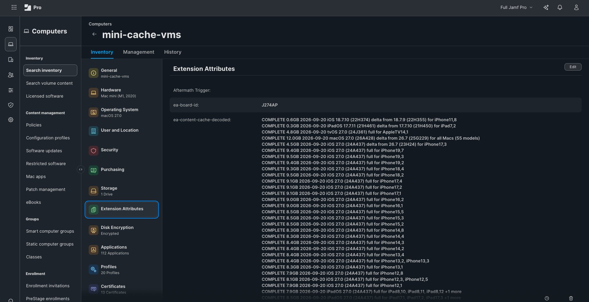

# Preheat: Preheating

[Preheat](../README.md) > Preheating

Filling a cache before the devices ask, and what can and cannot be filled.

## Preheating a cache without test hardware
The users in an office have the hardware; IT usually does not have a matching test device at
every site, and recruiting early adopters to "go first" so the cache fills is unreliable. The
readiness check already knows which hardware and build combinations each server must be ready
for, and Apple's lookup service returns the asset URL for any of them without a device in
hand. A cache server accepts a request for any Apple CDN URL from any Mac on its network. Put
together: IT can warm every office's cache for the hardware that office actually has, from a
script, with no test fleet and no volunteers. First verified with a tvOS 27.0 update for an Apple
TV 4K, pulled through a Mac mini cache with no Apple TV present; the cache grew by exactly its
size.

    python3 admin/readiness-check.py --platforms all --preheat-plan plan.json   # every MISSING/PARTIAL asset per server
    sudo bash admin/preheat.sh plan.json                                        # on the cache server: pulls its own entries
    bash admin/preheat.sh plan.json --server 192.168.x.x:49419 --guid <GUID>  # or from any Mac on that network

**Hardware that is not in inventory yet.** `--preheat-models` adds models nobody has enrolled
to the plan, for "200 new iPhones arrive Monday" or "we are buying more of what we already run".
Name models, or a whole family: `all`, `mac`, `iphone`, `ipad`, `appletv`, `visionpro`:

    # new hardware ships on the current OS: full images
    python3 admin/readiness-check.py --preheat-plan plan.json --preheat-models "iPhone18,3 Mac17,5"
    # more of a model the fleet runs on 26.7 (and a few still on 26.0): the deltas those devices will ask for
    python3 admin/readiness-check.py --preheat-plan plan.json --preheat-models "iPhone17,3 iPad15,8" --from 26.7,26.0

`--from` matters because a device downloads a delta from its current build, not the full
image; the script finds the build of that version Apple offers the model a delta from
(a version can have several builds), or takes `26.7:23H24` to name it. Where Apple offers no
delta the full image is planned. `--target` / `--target-build` choose the destination as
usual, `--preheat-server NAME_OR_GUID` limits it to one office, files a server already holds
are skipped, and these extra models never count towards the readiness EA. A model Apple
does not answer for yet (announced, not shipped) is reported and skipped; run it again later.

Proven on a real device (2026-09-20): an iPad Pro 12.9-inch from 2017 on iPadOS 17.7.10 was
planned with `--preheat-models "iPad7,2" --from 17.7.10`, which chose the 0.3 GB delta rather
than the 5.3 GB full image, and the cache server pulled it. The iPad then ran the update: by
the cache's own counters it was served 339.8 MB while 6.4 MB came from Apple, all of that
before the download began (small companion files). Checking for updates had cached nothing
beforehand, and with a VPN on, the same iPad could not see the cache at all.

**Timing matters more than anything else here.** A device starts fetching an update on its own
schedule, often within minutes of learning about it, and whatever it fetched before the file was
cached came from Apple. In the second real-device test an iPhone XR had already taken about 230 MB
of its 583 MB delta directly before the file was preheated; the remaining 353 MB came from the
cache, with nothing from Apple. So preheat when Apple publishes, before devices check in: release
day, the evening before an enforced deadline, the weekend before new hardware is unboxed. A week
later most of the benefit has gone, because the first device at each site has already filled the
cache the ordinary way.

*The top two lines are the deltas an iPhone XR and a 2017 iPad Pro actually needed, planned from inventory, pulled by the cache server, and named by it at the next check-in. (Taken 2026-09-20, when there was still a Board ID EA; see [What is an EA, what is not, and why](REFERENCE.md#what-is-an-ea-what-is-not-and-why).)*

**Xcode components.** A new Xcode sends every developer to fetch the same simulator runtimes
(7 to 9 GB each) and Metal toolchain. `--preheat-xcode` plans them from Apple's public simulator
index, the same one Xcode reads, so Xcode need not be installed on the admin Mac:

    python3 admin/readiness-check.py --preheat-plan plan.json --preheat-xcode 27.0                        # iOS runtime + Metal toolchain
    python3 admin/readiness-check.py --preheat-plan plan.json --preheat-xcode latest --xcode-platforms all  # iOS, tvOS, watchOS, visionOS

Verified 2026-09-26: the iOS 27.0 Simulator Runtime (8.1 GB) pulled through a Mac mini cache and
was named by the decoded EA. Xcode itself and Xcode's own installer are not cacheable content;
only the components it downloads afterwards are.

**Full macOS installers and Aerials.** `--preheat-installers` plans InstallAssistant.pkg from
Apple's software update catalog, the file `softwareupdate --fetch-full-installer` and Jamf's
installer packages download, for erase-and-install and rebuild work; `--preheat-aerials` plans
the screen saver videos, half a gigabyte each on average and up to 1.5 GB, that every Mac in a lobby or classroom otherwise
fetches for itself:

    python3 admin/readiness-check.py --preheat-plan plan.json --preheat-installers latest        # newest of each major (27.0, 26.7, 15.8 ...)
    python3 admin/readiness-check.py --preheat-plan plan.json --preheat-installers 27,26.7        # exactly these
    python3 admin/readiness-check.py --preheat-plan plan.json --preheat-aerials cities,landscapes  # or all (164 videos, 80 GB)

`preheat.sh` finds the local cache's GUID and port itself, takes the plan as a file or a URL
(so it can be a Jamf policy scoped to the "Content Caching - Servers" Smart Group, with the plan
URL as script parameter 4), and has `--dry-run`, `--max-gb N` and `--platform` filters.
It checks that every file arrived whole, not only that the download started: a file cut short
is asked for again, up to three times (the cache keeps what it has and fetches the rest), and
the script ends with an error if anything is still incomplete.
Mind the sizes (see [What one OS release looks like in a cache](FINDINGS.md#what-one-os-release-looks-like-in-a-cache)); the plan prints totals first.
After a preheat, an inventory update on the server refreshes its assets EA, and the next
readiness run turns MISSING into COMPLETE without any device having downloaded anything.
This removes the "one test device per hardware family per site" requirement from the two-wave
plan in [Blueprints](BLUEPRINTS.md#using-this-with-ddm-software-updates-blueprints): wave one becomes optional, useful mainly as a canary for the update itself.

## What else the cache holds, and what can be preheated
Content caching stores far more than OS updates: App Store apps, iCloud photos and documents,
Xcode components and simulators, Rosetta, dictionaries and Siri voices, Aerial screen savers,
Books, and Apple Intelligence models (Apple's list is
[here](https://support.apple.com/en-us/102860)). A lab cache that was never asked to hold
anything but OS updates picked up 100 GB of iCloud data on its own within a day.

Preheating needs a file's URL before any device asks, and that decides what Preheat can do:

| Content | URL known in advance? | Preheat |
|---|---|---|
| OS updates and deltas | yes, Apple's lookup service | yes (this project) |
| Full macOS installers | yes, Apple's software update catalog | **yes**, `--preheat-installers` |
| Xcode simulator runtimes, Metal toolchain | yes: Apple's public simulator index names them, the lookup service gives the file | **yes**, `--preheat-xcode` |
| Aerial screen savers | yes, Apple's public Aerial manifest | **yes**, `--preheat-aerials` |
| Dictionaries, Siri voices, image-caption models, other mobile assets | yes, the lookup service's generic audience | not yet; small change |
| App Store apps | only at download time, per device | no; a first device fills the cache |
| iCloud data | no; per user and encrypted | no; caches on its own |
| Apple Intelligence models | no; served by Apple's Unified Asset Framework, which the public lookup service does not know (checked 2026-09-26: every `UAF_` asset type is "AssetType not found") | no; a first eligible device with Apple Intelligence on fills the cache for the rest |

So for apps and Apple Intelligence models the two-wave pattern is the whole answer: one device per
site goes first, everyone else downloads locally. Preheat's readiness EA does not count those
files, but the decoded EA names what it can and the effectiveness EA shows the sharing.
