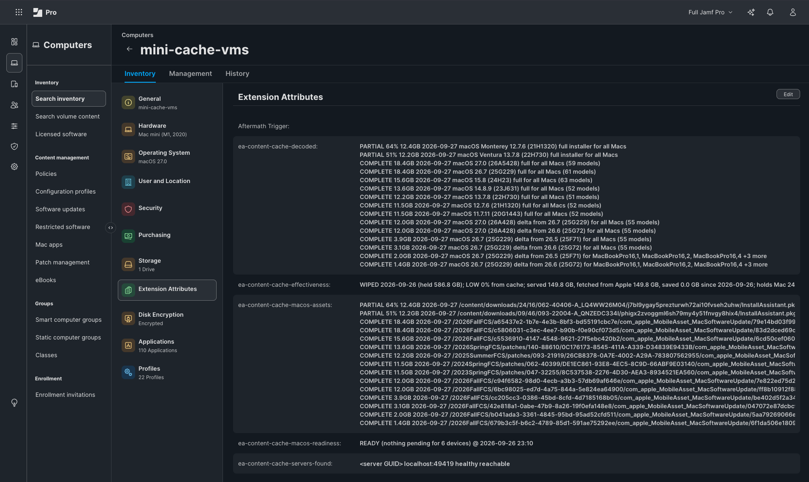
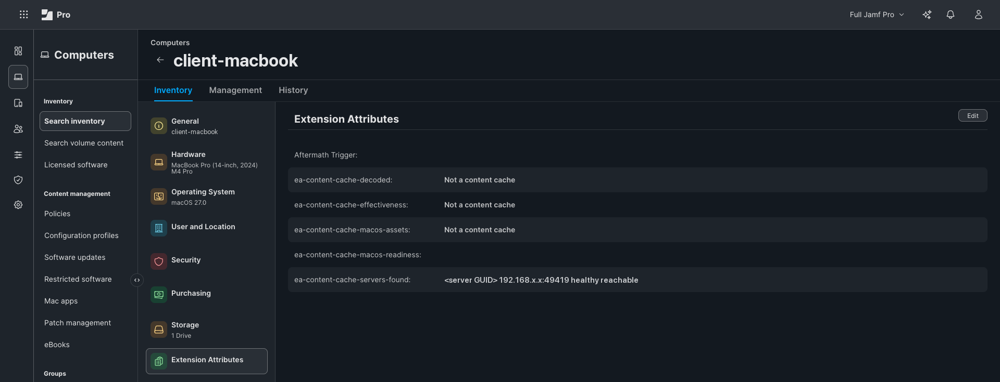
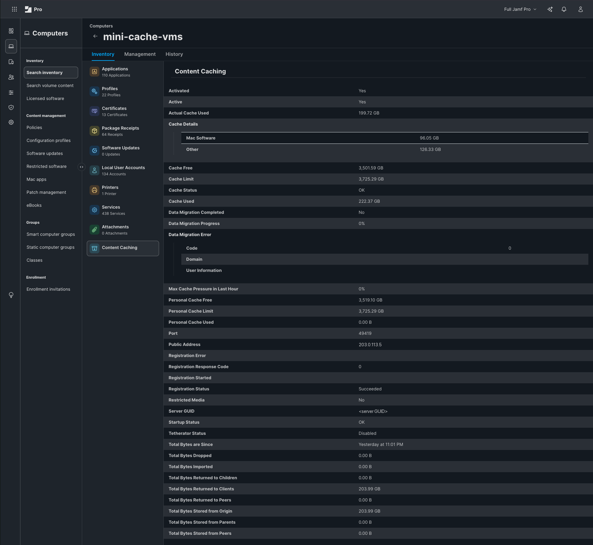
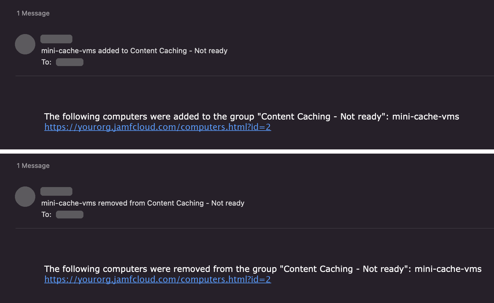

# Preheat: Reference

[Preheat](../README.md) > Reference

How Preheat works, piece by piece.

## The goal
Goal: know, from Jamf Pro, whether each Apple content caching server already holds the
OS update that every hardware family **on its own network** would download: macOS by
default, and iOS, iPadOS, tvOS and visionOS with `--platforms`. Office X's
server is judged against the Macs that use Office X's server, Office A's against Office A's.

## Pieces

| File | Where it runs | What it does |
|---|---|---|
| `ea/ea-content-cache-status.sh` | every Mac (EA "Content Caching - Status") | "Not a content cache", "Active; guid <GUID>; ..." or "Inactive (<reason>); guid <GUID>". Worked out during inventory, so the Smart Groups that raise alerts are built on it. |
| (from Jamf) Content Caching inventory | every Mac, collected by Jamf itself | The same facts and more (server GUID, port, addresses, space, counters), read by the admin scripts. Collected just after inventory, so Smart Groups on it run one inventory behind. |
| `ea/ea-content-cache-servers-found.sh` | every Mac (EA "Content Caching - Servers Found") | Which cache server(s) this Mac would use, as macOS itself decides: `<GUID> host:port healthy reachable`. |
| `ea/ea-content-cache-macos-assets.sh` | every Mac (EA "Content Caching - macOS Assets") | On cache servers: one line per cached OS update or installer, any Apple platform, with COMPLETE or PARTIAL nn% and Apple's opaque path. The machine key the admin script joins on. |
| (no script) | mobile devices (Mobile Device EA "Content Caching - Server", input type Text Field) | Written by the admin script: which cache server this device matched, "<server name> guid <GUID>", or "None found". Basis for Smart Mobile Device Groups. |
| `ea/ea-content-cache-effectiveness.sh` | every Mac (EA "Content Caching - Effectiveness") | On cache servers: is the cache earning its keep? "GOOD 87% from cache; served 1840 GB, fetched from Apple 239 GB, saved 1601 GB since 2026-06-01; holds ...; pressure 0.2". First word GOOD / FAIR / LOW / NEW is the contract for Smart Groups. |
| `ea/ea-content-cache-decoded.sh` | every Mac (EA "Content Caching - Cached Updates") | On cache servers: the assets EA translated for humans, one line per cached asset, e.g. "COMPLETE 2.1GB 2026-09-19 tvOS 27.0 (24J361) delta from 26.0.1 (23J362) for AppleTV14,1". Reads a local labels file, makes no network calls. The raw path EA stays as the machine key. |
| `admin/preheat-labels.py` | cache servers, from a Jamf policy | Writes the labels file the decoded EA reads: asks Apple's lookup service what every model would download and keeps path -> name in `/Library/Application Support/preheat/labels.json`. Needs no Jamf credentials. Only touches the network when the cache holds a file it has not named yet. |
| `admin/create-labels-policy.py` | an admin Mac, once | Uploads `preheat-labels.py` to Jamf and creates the policy that runs it: recurring check-in, ongoing, Update Inventory, scoped to "Content Caching - Servers". Disable the policy to stop it; run again to update the script. |
| (no script) | cache servers (EA "Content Caching - macOS Readiness", input type Text Field) | Not collected by the Mac. The admin script writes it through the API: "READY 3/3 combos, 41 devices @ date", "PARTIAL 2/3 combos, 30/41 devices @ date", or "NOT READY 0/3 combos, 0/41 devices (1 still downloading) @ date". Empty on Macs that are not cache servers. |
| `admin/preheat.sh` | a cache server (or any Mac on its network) | Pulls the assets a plan says that server is missing through the cache itself, so it is warm for the hardware that site's users have without IT needing a test device there. Plan comes from `readiness-check.py --preheat-plan`. |
| `admin/readiness-check.py` | an admin Mac, or a scheduled job | Groups Macs by the server they report, asks Apple what each hardware/build would download, checks the server's cached assets; prints a per-server report; `--write` fills EA "Content Caching - macOS Readiness" on each server. |
| `admin/sync-eas.py` | an admin Mac, once and after any change to a file in `ea/` | Creates the five script EAs in Jamf (`--create`) and keeps the script stored in each one the same as the file here. |
| `admin/create-smart-groups.py` | an admin Mac, once | Creates the Smart Groups listed under [Jamf setup](SETUP.md#jamf-setup); `--served-by` adds the two groups for one office; `--dry-run` shows what it would do. |
| `terraform/` | an admin Mac or a pipeline | The same installation as code: EAs, Smart Groups, the labels script and its policy. An alternative to the two scripts above, not an addition. See [`terraform/README.md`](../terraform/README.md). |
| `admin/doctor.py` | an admin Mac, any time | Read-only health check of the whole installation: Apple's lookup service and AppleDB, credentials, each API privilege and what it is for, every EA (and whether it matches the repo), Smart Groups, the labels policy, each cache server's state, Macs with empty EAs, mobile devices behind a VPN. PASS / WARN / FAIL with the command that fixes it. Start here when something looks wrong. |
| `admin/cache-collect.sh` | a cache server, with sudo | Read-only diagnostic report of a cache server (settings, status, locator, database layout, recent log lines). Written on day one to learn how the cache stores things; still useful when a server misbehaves and you want everything in one file. |

Every script answers `--help` and changes nothing when asked. All of them on one page:
[docs/USAGE.md](USAGE.md), generated from the scripts by `admin/make-usage.sh`.

*Everything the project produces, on one cache server's record: decoded cached updates (the top two lines are downloads in progress), effectiveness, raw cached assets, readiness, servers found. Decoded and raw lists match line for line. The effectiveness line starts with WIPED: the cache's drive had been erased the evening before, and it is being refilled.*

*The same EAs on an ordinary Mac: every cache EA says "Not a content cache", and "servers found" names the cache this Mac would use. That one line is what ties a device to an office.*

The EAs are named "Content Caching - Status", "Content Caching - Servers Found" and so on (the table under
[EA definitions](SETUP.md#ea-definitions-as-the-jamf-form-asks-for-them)). Screenshots taken before 2026-09-27 show them under the names they had then,
ea-content-cache-status and so on; the values are the same.

## How it works
- The cache database (`AssetInfo.db`, table ZASSET) stores each cached asset's URL path
  without the host, and stores its bytes in a folder named by the row's GUID. An asset is
  complete when that folder's size reaches ZTOTALBYTES.
- Apple silicon update assets are opaque: `/2026FallFCS/<uuid>/com_apple_MobileAsset_MacSoftwareUpdate/<sha1>.zip`.
  Apple's lookup service (POST gdmf.apple.com/v2/assets, with board ID, model, current version
  and build) returns the exact URL a given device would download, so the admin script can
  ask "is this path cached?" for every hardware/build combination in inventory.
- The cache never prefetches. It fills when the first Mac of a hardware family downloads
  through it: either a DDM declaration doing its background download, or a user running
  Software Update. See [Using this with DDM software updates](BLUEPRINTS.md#using-this-with-ddm-software-updates-blueprints).

## Where each fact comes from: Jamf inventory, EAs, DDM
Preheat reads four sources. They differ in what they know, how fresh they are, and whether a Smart
Group can use them. This is the whole picture:

| | Jamf's own inventory | Extension attributes | DDM status | Readiness |
|---|---|---|---|---|
| Produced by | Jamf, from every Mac, with no setup | a script Jamf runs on every Mac (five of them) | the cache server itself, on macOS 27 | `readiness-check.py --write` |
| Tells you | which Macs are cache servers; each one's GUID, port, addresses, space and counters; every device's model, OS and build | whether a Mac is a cache and serving, what a cache holds, which cache each Mac would use, whether the cache earns its keep, WIPED | whether the cache is switched on, running and registered; its address, port, peers and parents | READY, PARTIAL or NOT READY for the devices a cache serves |
| Changes when | just after the Mac sends inventory | the Mac sends inventory | the cache changes state | the script runs |
| A Smart Group sees it | one inventory later | at that inventory | never | when the script writes it |
| Smart Groups | yes: "Content Caching - Activated", "- Active", "- Cache Status" | yes | **no** | yes |
| Email on change | through a Smart Group | through a Smart Group | no | through a Smart Group |
| Needs | macOS 10.15.4 | the EAs installed; python3 on cache servers | macOS 27 on the cache server | an API client; a schedule if it is to stay current |

How they are used together:

- **Smart Groups, the dashboard and email alerts** run on the first, second and fourth column.
  They are as fresh as the last inventory update, or the last run of the script.
- **Groups on Jamf's own Content Caching criteria run one inventory behind.** Jamf collects that
  section with a command it sends just after each inventory, by which time the groups have been
  worked out. That is why the groups in this project are built on the status EA, and why that EA exists
  although Jamf has the same facts.
- **DDM status is the freshest word on whether a cache is up**, but Jamf cannot build a group on
  it. The scripts read it instead: `readiness-check.py` turns a cache that is down into NOT READY,
  which a Smart Group does see, and `doctor.py` reports it. That is how a change DDM noticed
  reaches an alert.
- **One fact is collected twice, on purpose:** the cache's status, for the reason above (see
  [What is an EA, what is not, and why](#what-is-an-ea-what-is-not-and-why)). Every other EA reports what nothing else does.
- **DDM also delivers the updates.** That is a different use of the same channel: see [Using this with DDM software updates (Blueprints)](BLUEPRINTS.md#using-this-with-ddm-software-updates-blueprints).

## What is an EA, what is not, and why
**The board ID is not an EA.** Every Mac's board comes from its model identifier through AppleDB,
the way it always has for iPhone and iPad. (`ea/ea-board-id.sh` stays in the repository for Macs
from before 2016, where one model came with more than one board; `doctor.py` says if you have any.)
An older installation may still have a Board ID EA. Nothing reads it; delete it rather than
disable it, because a disabled EA still appears on inventory records.

**The cache's status is both.** Jamf collects it on its own, in the Content Caching section of the
inventory record, and the admin scripts read it there. But Jamf collects that section with a
command it sends just after inventory, so a Smart Group built on Jamf's criteria is one inventory
behind: a day, with daily inventory. Alerts should not be a day late, so the groups are built on
a status EA, which is worked out during inventory. For a short while (2026-09-27) this project
used Jamf's criteria alone; the delay was seen on a second cache and the EA came back.

If you do build a group on Jamf's criteria, note that every Mac has a cache "Server GUID" and a
"Cache Status" of OK, cache server or not. Only "Activated" says that a Mac is one.

*What Jamf collects on its own from a cache server: state, registration, server GUID, port, addresses, space, and the served and fetched counters. Jamf shows sizes in binary units, so a 4 TB limit reads 3,725.29 GB. "Returned to Clients" equals "Stored from Origin" here because this cache was being refilled by preheating: every file had been fetched once and served once.*

## How Macs are matched to a server
Default (`--group-by locator`): each Mac's "Servers Found" EA lists the cache server GUID(s)
macOS would use, based on Apple's locator service (public IP + local subnet rules). This is
the same decision the OS makes at download time, so it's authoritative. Macs that report
"None found" are listed at the end of the report, grouped by site and building, so you can
see which offices have no cache at all.
Alternative (`--group-by building`): Macs in the same Jamf building as the server.

## Devices that come and go: the 90-day memory
Laptops leave the office; readiness should still count them. "Served by" is therefore a
rolling window, not a snapshot:
- Macs: the servers-found EA keeps a small state file
  (`/Library/Application Support/preheat/servers-seen.json`) and reports every
  server seen in the last 90 days: `<GUID> host:port healthy reachable` when found right
  now, `<GUID> host:port last-seen YYYY-MM-DD` otherwise. "None found" only after 90 days
  without one. Change `STICKY_DAYS` at the top of the script to alter the window.
- Mobile devices: the admin script writes `<server> guid <GUID> seen YYYY-MM-DD` and keeps
  earlier sightings inside the window (`--sticky-days`, default 90) when today's match fails.
- Readiness counts a device for every server it was seen on within the window. A device
  that splits time between two offices makes both caches responsible for its hardware
  family, which is the safe direction: over-counting only asks for one more cached asset,
  under-counting produces a false READY.
- Unrelated: `--max-age-days` (default 30) drops devices that have stopped reporting to
  Jamf at all. That is about dead records, not travel.

## iOS, iPadOS, tvOS and visionOS
Macs are always included. `--platforms all`, or a list such as `ipados,tvos`, adds Jamf
mobile device inventory as well. The API client then also needs Read Mobile Devices.
Differences from Macs:
- Mobile devices cannot run EA scripts, so there is no board ID EA and no "servers found"
  EA. The script maps model identifier to board ID with the public AppleDB device list
  (cached for 7 days in ~/Library/Caches/preheat/). To match a device to a server it
  uses Apple's own locator rule: the device's public IP (which is what Jamf records for
  mobile devices) must equal the server's public IP (Public Address in its Content Caching inventory). Failing
  that, subnet (`--subnet-bits`) and then Jamf building.
- Apple's lookup service is queried with the platform's own asset type and audience. iOS,
  iPadOS and tvOS are verified on devices or by pulling their files; visionOS answers correctly for
  both Vision Pro models but has not been tried on one.
- The cache lists mobile OTA assets under the same MobileAsset path family, and the assets EA
  now includes them. Apple Watch and HomePod updates
  that land in a cache are named by the decoded EA, but Jamf does not inventory those devices, so
  they never count towards readiness.
- DDM enforced updates pre-download on these platforms too, so the two-wave plan in [Blueprints](BLUEPRINTS.md#using-this-with-ddm-software-updates-blueprints)
  applies unchanged.
- Smart Mobile Device Groups: mobile devices carry none of the script EAs, so the admin
  script writes one Text Field mobile device EA, "Content Caching - Server" (create it in
  Jamf: Mobile Device Extension Attributes, Text Field), with "<server name> guid <GUID>" or
  "None found". `admin/create-smart-groups.py` then creates "Mobile devices with no content
  cache" and, with `--served-by`, "Mobile devices served by <office> cache": the scope for a
  wave-one iPadOS/tvOS Blueprint.

## Large sites: several public addresses, favored caches, peers
Apple's rule for offering a cache is "same public address as the device". Large networks bend
that rule in three ways, and Apple has an answer to each. Preheat follows Apple's answer.

| On the network | What Apple does | What Preheat does |
|---|---|---|
| The site reaches the internet from several public addresses | The site publishes them in a DNS TXT record (`_aaplcache._tcp`, key `prs` or `prn`); devices read it and tell Apple's locator | Treats those addresses as one site: an iPhone or iPad coming from any of them is matched to the caches registered from any of them |
| Some caches are to be preferred | A second record (`fss` or `fsn`) names the favored caches' LAN addresses; while one is up, devices use no other | Judges a device only against the favored caches it would really use |
| More than one cache on the network | They become peers and hand each other content before asking Apple | A file held by a peer counts: `COMPLETE on peer <name>`, and it is left out of the preheat plan |

Macs need nothing new: their "Servers Found" EA already reports the caches macOS chose, whatever
the addresses. It now also marks a cache `favored`, and adds one line when the network's DNS has
Apple's records, `dns: public 203.0.113.10-203.0.113.19; favored 10.0.0.30`. That line is how the
admin script learns a site's addresses with no configuration: any Mac on the site reports them,
including the cache server itself. Where no Mac reports them:

    python3 admin/readiness-check.py --platforms all --dns-domain corp.example.com          # read the TXT records, as devices do
    python3 admin/readiness-check.py --platforms all --public-ranges "203.0.113.10-203.0.113.19,198.51.100.7"   # or state them; repeat per site

Peers are the ones a cache reports itself (macOS 27, through DDM status). `--assume-peers` also
treats caches that share a public address and a subnet as peers; it is off by default because a
wrong guess would call a site READY when it is not. A peer that is not running is not counted.
Parents are reported and not counted: a parent is usually at another site, so its content still
crosses a WAN link.

Try it without a network of that kind:

    python3 admin/readiness-check.py --inventory-json admin/sample-inventory-large-site.json --platforms all

**What has been tested, and what has not (2026-09-27).** Peers, on two real caches: a second Mac
with content caching on became a peer of the lab cache within minutes, each reported the other
through DDM, and a 179 MB file asked of the new cache, which held nothing, came entirely from its
peer: 179.4 MB "from peers", nothing from Apple. The readiness check then left everything the
peer held out of the new cache's preheat plan. Several public addresses and favored caches have
run against the sample only; the TXT record formats, text and packed, against Apple's published
examples. Not yet seen: a DNS TXT record read by a real Mac, so the exact form in which macOS
reports the ranges is handled three ways, none confirmed. `doctor.py` lists the sites and peers
it finds, which is the quickest way to see whether a real network is being read correctly.

## Live status from the cache itself (macOS 27)
A cache server on macOS 27 reports its own state through declarative device management: switched
on, running, registered with Apple, address and port, parents and peers. Jamf Pro keeps these
status items and its API returns them, each with the time it last changed. They change when the
cache changes state, so they are newer than inventory whenever something happened in between.

`readiness-check.py` and `doctor.py` read them when they are there:

    ### cache-hq  [HQ]  guid ...  Active; ...
        reported by the Mac itself (DDM, 2026-09-26 23:02): running, registered with Apple, address 10.0.0.2 port 49152

- A cache that is switched off, not running or not registered is **NOT READY**, whatever its
  file list says, with the reason and the time: `NOT READY cache is down: content caching is
  switched off since 2026-09-26 22:53`. The files may be on disk; no device can get them.
- If the cache changed state after its last inventory, both scripts say that the file list is
  older than the change.
- Nothing to set up. With an older macOS on the server, an older Jamf Pro, or an API role that
  cannot read DDM status, the scripts find no status items and use inventory alone, as before.

**A cache server that goes silent.** A server that is switched off, or off the network, reports
nothing: no inventory arrives, so its record in Jamf stays as it was, no Smart Group changes and
no alert is sent. Jamf goes on showing an Active, READY cache that no device can reach. So the
readiness check also looks at when Jamf last heard from each cache server in any way (a check-in,
an inventory update or a DDM status report). Past the limit the verdict is
`NOT READY cache server silent since 2026-09-28 19:18`, which the "Not ready" group and its email
pick up, and `doctor.py` reports the same. The limit is three times your check-in frequency and at
least 30 minutes. If the API role cannot read the frequency (it needs Read Computer Check-In) the
limit is 180 minutes, which is safe for the longest check-in Jamf Pro allows; `--silent-minutes N`
sets it and 0 switches the check off. It can only warn you if the
check runs on a schedule.

Two limits, as of 2026-09-26. The size figures among the status items (used, free) are only
refreshed when the content caching declaration sets `DeclarativeStatusInterval`, so the scripts
do not use them. And the states above were read from a healthy cache and one that had been
switched off; how a suspended cache (see [Thin links and outages](FINDINGS.md#thin-links-and-outages)) reports itself is not yet tested.

Jamf Pro also collects cache statistics on its own, in the Content Caching section of a Mac's
inventory: state, limit, used, free, and the served and fetched counters. It does not list what
the cache holds, which devices use it, or whether it is ready; that is what the EAs add.

## Why did this Mac download an update at 1 pm?
Apple posts releases at about 10:00 Pacific. A Mac with a software update enforcement declaration
starts downloading the moment the release posts, deadline or not, and App Store automatic updates
do the same. Fifty Macs pulling the same file at 1 pm Eastern on a release day is the release, and
it is what a content cache exists to absorb: one download from Apple, the rest from the LAN.

Three places answer "why, and when" for one Mac, fastest first.

1. **Jamf Pro's DDM status for the Mac**: `GET /api/v1/ddm/<managementId>/status-items`.
   `softwareupdate.install-reason.reason` reads `declaration` when a Blueprint caused it, with
   `softwareupdate.pending-version.*` and the time each item changed. No log needed; the API role
   must be able to read DDM status.
2. **The cache's log**, if the site has one: every request from every device by time, and by
   device with Log client identity on (see [Blueprints](BLUEPRINTS.md)):
   `/usr/bin/log show --last 2h --info --predicate 'subsystem == "com.apple.AssetCache"'`.
3. **The Mac's own log.** The broad predicate (`process == "softwareupdated"`) runs to tens of
   thousands of lines an hour; this one keeps the lines that tell the story:

       /usr/bin/log show --start "2026-09-28 12:45" --end "2026-09-28 13:25" --info --style compact \
         --predicate '(process == "softwareupdated" AND (
              eventMessage CONTAINS "Starting scan with options"
           OR eventMessage CONTAINS "Adding SUCoreDDMDeclaration"
           OR eventMessage CONTAINS "Found DDM enforced install"
           OR eventMessage CONTAINS ">E> RequestDownloadUpdate"
           OR eventMessage CONTAINS "ACSLocateCachingServer ->"))
         OR (process == "mobileassetd" AND eventMessage CONTAINS "Sending download result"
             AND eventMessage CONTAINS "MacSoftwareUpdate.")'

   On a Mac that downloaded because of a declaration it reads like this:

       13:17:46  Adding SUCoreDDMDeclaration (DeclarationKey:com.apple.RemoteManagement.SoftwareUpdateExtension/...)
       13:17:46  Starting scan with options: Background=0, MDMInitiated=1, requestedPMV=27.0.1
       13:17:51  >S> ReadyToBegin >E> RequestDownloadUpdate
       13:18:05  ACSLocateCachingServer -> newURL http://<cache>:49419/...MacSoftwareUpdate/...
       13:18:33  Sending download result 0 (MADownloadSuccessful) ... MacSoftwareUpdate.<hash>
       13:21:19  Found DDM enforced install

   `MDMInitiated=1` within seconds of `Adding SUCoreDDMDeclaration` means the declaration did it;
   the `ACSLocateCachingServer` line says the bytes came from a cache, and which one. Only
   `Background=1` scans before the download means the Mac did it on its own schedule; nothing from
   `softwareupdated` at all means look at `appstoreagent`.

Three cautions. `--info` is required or the lines are missing. An OS install clears the log, so
take it before the Mac updates. The strings are macOS 27's and were not checked on earlier systems.

## Hardware coverage
The scripts take the model list from AppleDB and the answers from Apple's own lookup service, so
they are not limited to hardware anyone here owns. Checked on 2026-09-20 against every model
released since 2013: 330 of 346 get an answer, each the newest OS that model can run (an Intel
iMac from 2019 is offered macOS 15.8, an iPhone 8 iOS 16.7, an iPad from 2018 iPadOS 17.7), full
image or delta from any earlier release. The 16 without an answer are obsolete (2013 Macs, Apple
TV 3rd generation, iPhone 5c, first Apple Watch), not yet shipping, or regional variants AppleDB
lists under a board Apple does not answer for.

| Platform | Readiness (needs Jamf inventory) | `--preheat-models` and decoded names |
|---|---|---|
| Mac, Apple silicon and Intel | yes | yes |
| iPhone, iPad, Apple TV, Vision Pro | yes, with `--platforms` | yes |
| Apple Watch, HomePod | no: Jamf does not inventory them | yes (`Watch7,1`, `AudioAccessory6,1`) |

Two things that are easy to get wrong, both handled: Intel Macs with a T2 chip (2018 to 2020)
report a `Mac-xxxx` board ID, but Apple answers for the T2's own board in capitals
(MacBookPro16,1 is J152FAP); asked with `Mac-xxxx` it offers only macOS 11. The admin script
makes that substitution from AppleDB. And a lookup with no
real source version must still send a plausible one: "0" is refused for HomePod and "1.0"
returns nothing for Apple TV. The T2 substitution was inferred from Apple's answers and later corroborated: the activation
predicates Jamf Blueprints generates for software updates identify the same Macs by the same
capitalised T2 board IDs (J152FAP and the rest). It has still not been tried on a T2 Mac; a tester
with one is welcome.

## Where this plugs into the rest of the Jamf platform
The readiness EA and the Smart Groups are the interface; everything below consumes them.

- **Alerts with no code.** Nine groups are worth alerting on:

  | Group | An email means |
  |---|---|
  | Content Caching - Servers | a Mac started or **stopped** being a cache server. A cache that loses its storage volume switches itself off and leaves this group; no other group sees that |
  | Content Caching - Inactive or broken | caching is on but not serving (suspended, not registered) |
  | Content Caching - Low on space | the cache volume is nearly full or missing: content is about to be evicted, or already cannot be stored |
  | Content Caching - Wiped recently | the cache deleted its content (see "A refused registration wipes the cache" under [Caveats](CAVEATS.md#caveats)) |
  | Content Caching - Not ready | a cache holds none of what its devices will ask for, or the cache is down, or the server has gone silent (off, or off the network). The one to act on before a push |
  | Content Caching - Ready for OS push | safe to release wave two |
  | Content Caching - Low benefit | a cache nobody is reaching |
  | Content Caching - On but not chosen | a Mac is caching that nobody chose as a server (see [Configuring the cache servers themselves with a Blueprint](BLUEPRINTS.md#configuring-the-cache-servers-themselves-with-a-blueprint-macos-27)) |
  | Content Caching - Chosen but not caching | a chosen server has caching off |

  Groups change when inventory arrives, so an alert is as fresh as the cache server's last
  inventory update. Simplest: tick "Send
  email notification on membership change" on the Smart Group itself (needs SMTP set up in
  Jamf Pro, and "Smart Computer Group Membership Change" ticked under your own account's
  Notifications). Verified: a readiness value written by the API triggers the email; no
  inventory submission is needed. With **Jamf Routines** (Business and Enterprise plans) the same membership
  change posts to Slack, Teams or Webex from a template. Any other destination works via a
  Jamf Pro webhook.

*The built-in group emails: one when the server entered "Content Caching - Not ready", one two minutes later when it left.*
- **Jamf Pro webhooks + JAWA** ([jamf/JAWA](https://github.com/jamf/JAWA)): the
  SmartGroupComputerMembershipChange webhook can trigger the readiness check itself, so a
  cache server entering "Content Caching - Servers" or a Blueprint's wave-one group finishing
  its downloads re-evaluates readiness immediately instead of on a timer.
- **Scheduling the check**: a launchd job on an admin Mac, or a GitHub Actions workflow on
  a cron with the three credentials as repository secrets. Both only need outbound HTTPS to
  Jamf Pro, gdmf.apple.com and AppleDB.
- **Terraform.** The `terraform/` folder installs everything in [Setup](SETUP.md) (the seven EAs, the ten Smart
  Groups, the labels script and its policy) with one `terraform apply`, using Jamf's own provider
  [jamf/jamfplatform](https://registry.terraform.io/providers/jamf/jamfplatform). It reads the EA
  and script bodies from `ea/` and `admin/`, so it is also how a script change reaches Jamf.
  `terraform/import.sh` brings a tenant that was set up by hand under management. See
  [`terraform/README.md`](../terraform/README.md); it needs a Platform API integration from Jamf Account, and has not yet
  been applied to a tenant.
- **jamf-cli** ([Jamf-Concepts/jamf-cli](https://github.com/Jamf-Concepts/jamf-cli)): a
  unified CLI for the Jamf Platform; the API calls in `admin/` could be rebuilt on it.
- **ddm-companion** ([Jamf-Concepts/ddm-companion](https://github.com/Jamf-Concepts/ddm-companion)):
  real-time visibility into DDM declarations landing on devices, the natural companion to
  the two-wave rollout: watch wave one's declarations arrive, then check readiness.
- **scope-map** ([Jamf-Concepts/scope-map](https://github.com/Jamf-Concepts/scope-map)):
  visualises what a Blueprint is scoped to; useful for sanity-checking the per-office groups.
- **Jamf Protect Unified Logging.** Protect's log filters take the same predicate as
  [Why did this Mac download an update at 1 pm?](#why-did-this-mac-download-an-update-at-1-pm).
  Added as a filter, it streams from every Mac the moment a declaration triggers a download, and
  the `ACSLocateCachingServer` line that says whether the bytes came from a cache, and which one.
  One search in the log destination then answers "who downloaded what, why, and from where" for
  the whole site on release day: the per-Mac effectiveness measure the EAs cannot give. Not yet
  tested here.
- **agent-skills / MCP** ([Jamf-Concepts/agent-skills](https://github.com/Jamf-Concepts/agent-skills),
  [Jamf-Concepts/mcp-hub](https://github.com/Jamf-Concepts/mcp-hub)): a packaged skill for
  "is office X's cache ready?" would let an AI agent answer from the EAs directly; a
  candidate contribution once this project stabilises.
