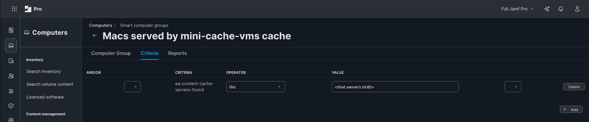

# Preheat: Setup

[Preheat](../README.md) > Setup

What a new installation needs, and how to install it.

## Requirements
What a new installation needs, from nothing. Nothing here is specific to the lab this was built in.

**Jamf Pro**
- Jamf Pro 11.31 or later (the Terraform provider is built against 11.31; the admin scripts use
  the modern API and were run against 11.32). Cloud-hosted or on-premises: everything goes
  through the API and the built-in inventory, nothing is installed on the server.
- Computers enrolled and submitting inventory, including every cache server. Mobile devices too,
  if you want iPhone, iPad, Apple TV or Vision Pro readiness.
- The "Calculate sizes" inventory option turned off if any Mac has a cloud drive in its home
  folder (see [Caveats](CAVEATS.md#caveats)): it hangs the inventory that carries these EAs.

**A Jamf Pro API role and client** (Settings > System > API roles and clients), for the admin
scripts. The privilege table under [Jamf setup](#jamf-setup) lists exactly what each feature needs; for
everything, that is: Read and Update Computers; Create, Read and Update Computer Extension
Attributes; Read and Update Mobile Devices; Read Mobile Device Extension Attributes; Read and
Create Smart Computer Groups; Read Static Computer Groups; Read and Create Smart Mobile Device
Groups; Read Static Mobile Device Groups; Create, Read and Update Scripts; Create and Read
Policies. Nothing that writes to profiles, users or settings.

**A Jamf Account API integration** (account.jamf.com), only if you use the Terraform module or
want Blueprints managed through the Platform API. It is a different credential from the one
above, registered against your platform environment; [`terraform/README.md`](../terraform/README.md) lists its permissions.

**An admin Mac** (or a CI runner) to run the admin scripts from:
- macOS with Python 3.8 or later. The system `/usr/bin/python3` is fine once the Xcode Command
  Line Tools are installed (`xcode-select --install`). No third-party Python packages.
- Outbound HTTPS to your Jamf Pro, to `gdmf.apple.com` (Apple's software lookup service) and to
  `api.appledb.dev` (the public model and build list).
- Terraform 1.8 or later, only for the Terraform module.

**The cache servers**
- Any Mac running content caching (System Settings > General > Sharing > Content Caching), with
  enough space for what it must hold: about 18 GB per macOS release, 8 to 10 GB per iPhone or
  iPad model per release, more for deltas from several source versions (see [What one OS release looks like in a cache](FINDINGS.md#what-one-os-release-looks-like-in-a-cache)).
- The Xcode Command Line Tools, so `/usr/bin/python3` is real: the labels policy and
  `preheat.sh` run Python on the server.
- A fixed address (DHCP reservation on the hardware MAC), no VPN client that connects at boot,
  and either FileVault off or someone to unlock it after a restart. Each of these, when wrong,
  costs the server its cache or its reachability (see [Caveats](CAVEATS.md#caveats)).
- Optional: Jamf Protect, to refuse every removable drive but the cache's own (see [Caveats](CAVEATS.md#caveats)).
- Enrolled in Jamf Pro like any other Mac. Nothing else is installed on it: the policy delivers
  the labels script at run time.

**Devices, for the parts that need them**
- The readiness verdict and the plans work for any device Jamf inventories: Macs (Apple silicon
  and Intel), iPhone, iPad, Apple TV, Vision Pro.
- DDM software update enforcement (Blueprints) needs iOS/iPadOS 17 or macOS 14; the Software
  Update Settings declaration needs iOS/iPadOS 18 or macOS 15 and supervision. Devices that do
  not qualify are still counted and preheated for; they update on their own schedule.
- Devices reach a cache only when they share its public IP and are not behind a full-tunnel
  VPN. Per-app ZTNA is fine (see [Caveats](CAVEATS.md#caveats)).

**Optional**
- SMTP configured in Jamf Pro, for the Smart Group membership emails.
- Jamf Routines, a webhook receiver or Jamf Pro webhooks, for alerts beyond email.

## EA definitions, as the Jamf form asks for them
All of them: Data Type = String, Inventory Display = Extension Attributes. Script EAs take the
whole file named here as the script. `python3 admin/sync-eas.py --create` creates and
updates the five script EAs for you; the two Text Field EAs are made by hand. The names are
exact: the admin scripts and the Smart Groups find each EA by its name.

| Display name | Input type | Description |
|---|---|---|
| Content Caching - Status | Script, `ea/ea-content-cache-status.sh` | Whether this Mac runs Apple content caching. "Not a content cache", or "Active; guid <GUID>; ip <LAN address>; port <port>; public <public address>; free <GB>; used <GB>; status OK", or "Inactive (<reason>); guid <GUID>" when caching is on and not serving. A cache whose storage volume went missing switches itself off; it reads "Inactive (LOWSPACE; caching switched itself off)". First word is the contract for Smart Groups. |
| Content Caching - Servers Found | Script, `ea/ea-content-cache-servers-found.sh` | Which content caching server(s) this Mac would use, as macOS itself decides via Apple's locator service, remembered for 90 days. One line per server: "<server GUID> <host:port> healthy reachable" when found now, "<server GUID> <host:port> last-seen YYYY-MM-DD" when seen within the window. "None found" means nothing in 90 days. |
| Content Caching - macOS Assets | Script, `ea/ea-content-cache-macos-assets.sh` | On cache servers only: one line per cached OS update, installer, Xcode simulator runtime, Metal toolchain or Aerial video, "COMPLETE <GB> <date> <path>" or "PARTIAL nn% ...". Read from the cache database; complete means every byte is on disk. "Not a content cache" elsewhere. |
| Content Caching - Server (Mobile Device EA) | Text Field | Written by admin/readiness-check.py --write, not collected by the device. The content caching server(s) this iPad, iPhone or Apple TV would use, matched by public IP the way Apple's locator does and remembered for 90 days: "<server name> guid <GUID> seen YYYY-MM-DD" or "None found". Only needed with --platforms; basis for the Smart Mobile Device Groups. |
| Content Caching - Effectiveness | Script, `ea/ea-content-cache-effectiveness.sh` | On cache servers only: of everything the cache delivered to devices, the share that did not have to be downloaded from Apple, from the cache's own counters. "GOOD" 70% or more, "FAIR" 30 to 69%, "LOW" under 30% (few devices use it, or devices cannot reach it: VPN, wrong network), "NEW" under 10 GB delivered so far. For 3 days after the cache loses more than 90% of its content between two inventory updates the value starts "WIPED <date> (held <GB>)": a cache that flushed itself goes straight back to looking healthy, and this is the only sign. Also what it holds by type, and cache pressure (near 1 means it is evicting content to make room). Counters restart when the cache is reset or flushed; the value says since when. A preheat counts as one delivery and one download, so a freshly preheated cache reads LOW until devices start using it. |
| Content Caching - Cached Updates | Script, `ea/ea-content-cache-decoded.sh` | On cache servers only: human-readable version of "Content Caching - macOS Assets", one line per cached OS asset with version, build, full or delta, and the models it serves. Names come from a local labels file kept current by the policy "Preheat - Refresh cache labels" (admin/preheat-labels.py); a file not named yet shows as "unidentified ... (labels refresh pending)". If you leave this EA as a Text Field instead, admin/readiness-check.py --write fills it, but only when that script runs. |
| Content Caching - macOS Readiness | Text Field | Written by admin/readiness-check.py, not collected by the Mac. Says whether this content caching server already holds the macOS update every hardware/build combination among the Macs that use it would download. READY = every combination cached and complete. PARTIAL = some cached. NOT READY = none. "combos" = distinct hardware family + current OS build pairs; "devices" = devices covered. Ends with the date of the last check. |

## Jamf setup
1. Create the computer EAs. Easiest: do step 2 first, then `python3 admin/sync-eas.py --create`,
   which creates the five script EAs from the files in `ea/` (and updates them whenever a file
   changes). By hand: five EAs, data type String, input type Script, with the names in the
   table above, exactly. Then one more by hand, "Content Caching - macOS Readiness", input type
   Text Field; the admin script fills it through the API. For mobile devices, also create one
   Mobile Device EA, "Content Caching - Server", input type Text Field (see [iOS, iPadOS, tvOS and visionOS](REFERENCE.md#ios-ipados-tvos-and-visionos)).
   Description to paste into the readiness EA:
       Written by admin/readiness-check.py, not collected by the Mac. Says whether this content
       caching server already holds the macOS update every hardware/build combination among
       the Macs that use it would download. READY = every combination cached and complete.
       PARTIAL = some cached. NOT READY = none. "combos" = distinct hardware family + current
       OS build pairs; "devices" = devices covered. Ends with the date of the last check.
   Every Mac that should count must be enrolled in Jamf and submitting inventory, including
   the cache servers themselves.
   Jamf runs the script text stored in the EA definition, so when a script in `ea/` changes,
   the EA in Jamf must be updated too: run `python3 admin/sync-eas.py` again, or paste it.
2. Create an API role and client. Grant only what you will use:

   | To do this | Privileges |
   |---|---|
   | Readiness report and `--write` for Macs | Read Computers, Read Computer Extension Attributes, Update Computers |
   | `--platforms` (iPhone, iPad, Apple TV, Vision Pro) | Read Mobile Devices, Update Mobile Devices, Read Mobile Device Extension Attributes |
   | `sync-eas.py` | Create and Update Computer Extension Attributes |
   | `create-smart-groups.py` | Read and Create Smart Computer Groups, Read and Create Smart Mobile Device Groups |
   | `--cohort` | Read Smart and Static Computer Groups, Read Smart and Static Mobile Device Groups |
   | The silent-server limit, from your check-in frequency (optional) | Read Computer Check-In |
   | `create-labels-policy.py` | Create, Read and Update Scripts; Create and Read Policies |
3. Run the check:

   Store the credentials once in the macOS login keychain (the secret is typed, not echoed,
   and never passes through a shell argument):

        python3 admin/readiness-check.py --store-credentials

   Every script then reads them from the keychain. For CI or a one-off run, the environment
   variables JAMF_URL, JAMF_CLIENT_ID and JAMF_CLIENT_SECRET take precedence when set. Never
   put them in a script, an EA, or a file inside the project.

        python3 admin/readiness-check.py            # report only, newest version Apple offers
        python3 admin/readiness-check.py --target 27.1 --write        # a specific version
        python3 admin/readiness-check.py --target-build 26B123 --write  # the build a declaration pins
        python3 admin/readiness-check.py --max-age-days 0              # include Macs not seen in 30+ days
        python3 admin/readiness-check.py --platforms all               # add iOS, iPadOS, tvOS, visionOS
        python3 admin/readiness-check.py --group-by building   # if the locator EA isn't deployed yet
        python3 admin/readiness-check.py --cohort "Hold on 26=26"      # a group held on the previous OS (see the DDM section)

4. Smart Groups (Computers > Smart Computer Groups > New). In the criteria picker the EAs sit
   among Jamf's own "Content Caching - ..." criteria; take the names in this table, which are
   the EAs (see [Where each fact comes from](REFERENCE.md#where-each-fact-comes-from-jamf-inventory-eas-ddm) for why not Jamf's). `python3 admin/create-smart-groups.py`
   makes all of them, and with `--update` brings an older installation's groups to these rules.

   | Name | Description | Criteria | Operator | Value |
   |---|---|---|---|---|
   | Content Caching - Servers | Macs running content caching, serving or not | Content Caching - Status | like | Active |
   | Content Caching - Ready for OS push | Cache servers whose local devices' update is fully cached | Content Caching - macOS Readiness | like READY **and** not like NOT READY | (two criteria: "NOT READY" also contains "READY") |
   | Content Caching - Partially ready | Some needed assets cached | Content Caching - macOS Readiness | like | PARTIAL |
   | Content Caching - Not ready | Cache servers still missing assets | Content Caching - macOS Readiness | like | NOT READY |
   | Content Caching - Inactive or broken | Caching not serving: not registered, suspended, storage gone | Content Caching - Status | like | Inactive |
   | Content Caching - Low on space | The cache volume is nearly full, missing or renamed | Content Caching - Status | like | LOWSPACE |
   | Content Caching - Low benefit | Caches that re-serve under 30% of what they download | Content Caching - Effectiveness | like | LOW |
   | Content Caching - Wiped recently | Caches that lost over 90% of their content in the last 3 days | Content Caching - Effectiveness | like | WIPED |
   | Macs served by <office> cache | Macs that will download through that office's server | Content Caching - Servers Found | like | <that server's GUID: Server GUID in the Content Caching section of its inventory record> |
   | Macs with no content cache | Macs that will pull updates straight from Apple | Content Caching - Servers Found | is | None found |
   | Mobile devices served by <office> cache (Smart Mobile Device Group) | iPads, iPhones, Apple TVs that will download through that office's server | Content Caching - Server | like | <that server's GUID> |
   | Mobile devices with no content cache (Smart Mobile Device Group) | Mobile devices that will pull updates straight from Apple | Content Caching - Server | is | None found |

   "like" means contains. The per-office group is the natural scope for a staged update policy:
   push to the office whose server is READY, hold the others.

*A per-office group is one rule: the servers-found EA contains that server's GUID.*
   Add `--served-by "Office X" <GUID>` to `create-smart-groups.py` to get both per-office groups.

5. Keep the decoded EA current: `python3 admin/create-labels-policy.py` uploads
   `preheat-labels.py` and creates the policy "Preheat - Refresh cache labels" (recurring
   check-in, ongoing, Update Inventory, scoped to "Content Caching - Servers"). Each cache server
   then names its own files at check-in, with no Jamf credentials on it. The same policy makes
   each cache server send inventory at every check-in, whatever the fleet's inventory schedule
   is: hourly with 60-minute check-ins, and on cache servers only. Ordinary Macs can stay on
   weekly or monthly inventory, because the cache they report is remembered for 90 days.
   Cache servers need
   `/usr/bin/python3`, which is only a stub until the Xcode Command Line Tools are installed
   (`xcode-select --install`, or a Jamf policy that installs them).
6. Check your work: `python3 admin/doctor.py` reads everything back and says what is missing.
7. Schedule step 3 with `--write` (hourly is plenty): readiness needs the inventory join, so
   it runs centrally. See "Scheduling the check" in [the list of what Preheat plugs into](REFERENCE.md#where-this-plugs-into-the-rest-of-the-jamf-platform).

## Where things live
Nothing is installed by hand on any Mac.

| What | Where | Notes |
|---|---|---|
| EA scripts, `preheat-labels.py`, `preheat.sh` (when run from a policy) | inside Jamf Pro | Jamf delivers them at run time and removes them afterwards; there is nothing to copy to a Mac |
| A cache server's or client's own state: `labels.json`, `servers-seen.json`, `cache-state.json` | `/Library/Application Support/preheat/` | written by the EAs and the labels script as root; safe to delete, it rebuilds |
| The admin scripts | wherever you cloned this repository | they run from there; nothing goes in `/usr/local/bin` |
| Admin-side download caches (model list, build list, update catalog, decoded names) | `~/Library/Caches/preheat/` | per user, safe to delete |
| Jamf credentials | the macOS login keychain, service `preheat` | or environment variables in CI |
